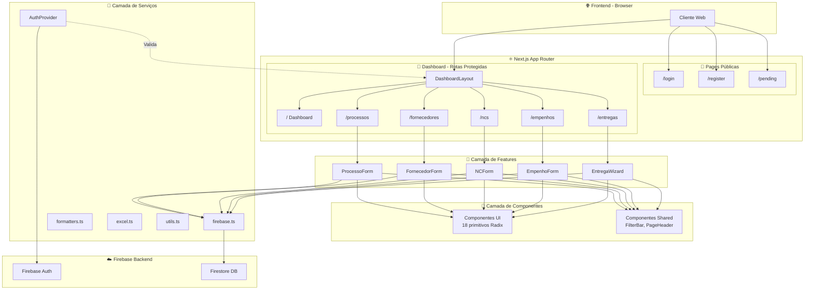

# 00 - VISÃO GERAL DO PROJETO

## 📌 Informações Básicas

| Atributo | Valor |
|----------|-------|
| **Nome do Projeto** | SGC-Gestão |
| **Versão** | 0.1.0 |
| **Tipo de Aplicação** | Aplicação Web SPA (Single Page Application) |
| **Domínio de Negócio** | Sistema de Gestão de Compras/Licitações Públicas |
| **Arquitetura** | Monolito Modular |
| **Padrão Arquitetural** | Feature-Based Architecture (FBA) |

---

## 🗂️ Mapa da Estrutura de Diretórios

```
📦 sgc-gest-o/
├── 📄 .env.local                      # Variáveis de ambiente (Firebase config)
├── 📄 .gitignore                      # Arquivos ignorados pelo Git
├── 📄 package.json                    # Dependências e scripts do projeto
├── 📄 tsconfig.json                   # Configuração do TypeScript
├── 📄 next.config.ts                  # Configuração do Next.js
├── 📄 postcss.config.mjs              # Configuração do PostCSS
├── 📄 eslint.config.mjs               # Configuração do ESLint
├── 📁 public/                         # Arquivos estáticos (5 arquivos)
│   ├── favicon.ico
│   ├── globe.svg
│   ├── next.svg
│   ├── vercel.svg
│   └── window.svg
└── 📁 src/                            # Código-fonte principal (46 itens)
    ├── 📁 app/                        # App Router do Next.js (17 itens)
    │   ├── 📄 layout.tsx              # Layout raiz da aplicação
    │   ├── 📄 globals.css             # Estilos globais
    │   ├── 📄 favicon.ico             # Favicon da aplicação
    │   ├── 📁 lib/                    # Bibliotecas utilitárias
    │   │   ├── 📄 firebase.ts         # Configuração do Firebase
    │   │   ├── 📄 excel.ts            # Exportação para Excel
    │   │   ├── 📄 formatters.ts       # Formatadores (moeda, data)
    │   │   └── 📄 utils.ts            # Utilitários gerais (cn)
    │   ├── 📁 login/                  # Página de login
    │   │   └── 📄 page.tsx
    │   ├── 📁 register/               # Página de registro
    │   │   └── 📄 page.tsx
    │   ├── 📁 pending/                # Página de aprovação pendente
    │   │   └── 📄 page.tsx
    │   └── 📁 (dashboard)/            # Grupo de rotas autenticadas
    │       ├── 📄 layout.tsx          # Layout do dashboard (sidebar + header)
    │       ├── 📄 page.tsx            # Dashboard principal (KPIs)
    │       ├── 📁 processos/          # Gestão de processos licitatórios
    │       │   └── 📄 page.tsx
    │       ├── 📁 fornecedores/       # Gestão de fornecedores
    │       │   └── 📄 page.tsx
    │       ├── 📁 ncs/                # Notas de Crédito
    │       │   └── 📄 page.tsx
    │       ├── 📁 empenhos/           # Gestão de empenhos
    │       │   └── 📄 page.tsx
    │       └── 📁 entregas/           # Controle de entregas
    │           └── 📄 page.tsx
    ├── 📁 components/                 # Componentes reutilizáveis (20 itens)
    │   ├── 📁 ui/                     # Componentes UI primitivos (18 arquivos)
    │   │   ├── alert.tsx
    │   │   ├── avatar.tsx
    │   │   ├── badge.tsx
    │   │   ├── button.tsx
    │   │   ├── card.tsx
    │   │   ├── checkbox.tsx
    │   │   ├── dialog.tsx
    │   │   ├── dropdown-menu.tsx
    │   │   ├── form.tsx
    │   │   ├── input.tsx
    │   │   ├── label.tsx
    │   │   ├── progress.tsx
    │   │   ├── select.tsx
    │   │   ├── sheet.tsx
    │   │   ├── switch.tsx
    │   │   ├── table.tsx
    │   │   ├── tabs.tsx
    │   │   └── textarea.tsx
    │   └── 📁 shared/                 # Componentes compartilhados
    │       ├── 📄 FilterBar.tsx       # Barra de filtros reutilizável
    │       └── 📄 PageHeader.tsx      # Cabeçalho de página padrão
    ├── 📁 features/                   # Módulos de funcionalidades (7 itens)
    │   ├── 📁 processos/
    │   │   └── 📁 components/
    │   │       └── 📄 ProcessoForm.tsx
    │   ├── 📁 fornecedores/
    │   │   └── 📁 components/
    │   │       ├── 📄 FornecedorForm.tsx
    │   │       └── 📄 ProcessoLinker.tsx
    │   ├── 📁 ncs/
    │   │   └── 📁 components/
    │   │       └── 📄 NCForm.tsx
    │   ├── 📁 empenhos/
    │   │   └── 📁 components/
    │   │       └── 📄 EmpenhoForm.tsx
    │   └── 📁 entregas/
    │       └── 📁 components/
    │           ├── 📄 EntregaWizard.tsx
    │           └── 📄 EntregaCard.tsx
    ├── 📁 providers/                  # Context Providers
    │   └── 📄 AuthProvider.tsx        # Autenticação e autorização
    └── 📁 types/                      # Tipagens TypeScript
        └── 📄 index.ts                # Tipos globais (Processo, Fornecedor)
```

---

## 🛠️ Stack Tecnológica Completa

### Framework Principal
| Tecnologia | Versão | Propósito |
|------------|--------|-----------|
| **Next.js** | 16.0.3 | Framework React fullstack com App Router |
| **React** | 19.2.0 | Biblioteca de UI (versão mais recente) |
| **TypeScript** | ^5 | Tipagem estática |

### Backend/Database
| Tecnologia | Versão | Propósito |
|------------|--------|-----------|
| **Firebase** | 12.6.0 | Backend-as-a-Service |
| Firebase Auth | incluído | Autenticação de usuários |
| Firestore | incluído | Banco de dados NoSQL |

### Estilização
| Tecnologia | Versão | Propósito |
|------------|--------|-----------|
| **Tailwind CSS** | ^4 | Framework CSS utilitário |
| **PostCSS** | via plugin | Processador CSS |

### UI Components
| Tecnologia | Versão | Propósito |
|------------|--------|-----------|
| **Radix UI** | múltiplas | Componentes primitivos acessíveis |
| @radix-ui/react-avatar | 1.1.11 | Avatar de usuário |
| @radix-ui/react-checkbox | 1.3.3 | Checkbox acessível |
| @radix-ui/react-dialog | 1.1.15 | Modais e diálogos |
| @radix-ui/react-dropdown-menu | 2.1.16 | Menus dropdown |
| @radix-ui/react-label | 2.1.8 | Labels acessíveis |
| @radix-ui/react-progress | 1.1.8 | Barras de progresso |
| @radix-ui/react-select | 2.2.6 | Select estilizado |
| @radix-ui/react-slot | 1.2.4 | Composição de componentes |
| @radix-ui/react-switch | 1.2.6 | Toggle switch |
| @radix-ui/react-tabs | 1.1.13 | Sistema de abas |
| **Lucide React** | 0.555.0 | Biblioteca de ícones |

### Formulários e Validação
| Tecnologia | Versão | Propósito |
|------------|--------|-----------|
| **React Hook Form** | 7.68.0 | Gerenciamento de formulários |
| **@hookform/resolvers** | 5.2.2 | Integrações de validação |
| **Zod** | 4.1.13 | Validação de schemas |

### Animações
| Tecnologia | Versão | Propósito |
|------------|--------|-----------|
| **Framer Motion** | 12.23.25 | Animações declarativas |

### Utilitários
| Tecnologia | Versão | Propósito |
|------------|--------|-----------|
| **clsx** | 2.1.1 | Concatenação de classes CSS |
| **tailwind-merge** | 3.4.0 | Merge inteligente de classes Tailwind |
| **class-variance-authority** | 0.7.1 | Variantes de componentes |
| **ExcelJS** | 4.4.0 | Geração de arquivos Excel |
| **xlsx-js-style** | 1.2.0 | Estilos para Excel |

### DevDependencies
| Tecnologia | Versão | Propósito |
|------------|--------|-----------|
| **ESLint** | ^9 | Linting de código |
| **eslint-config-next** | 16.0.3 | Regras ESLint para Next.js |
| **babel-plugin-react-compiler** | 1.0.0 | Compilador experimental React |

---

## 🏗️ Diagrama da Arquitetura



---

## 📦 Módulos e Componentes Principais

### 1. 🔐 Módulo de Autenticação
| Arquivo | Linhas | Descrição |
|---------|--------|-----------|
| `AuthProvider.tsx` | 92 | Provider de autenticação com aprovação de usuários |
| `login/page.tsx` | ~100 | Tela de login com Firebase Auth |
| `register/page.tsx` | ~100 | Tela de registro de novos usuários |
| `pending/page.tsx` | ~50 | Tela de aguardando aprovação |

**Fluxo de Autenticação:**
```
Registro → Aguardando Aprovação → Aprovado por Admin → Acesso ao Dashboard
```

### 2. 📊 Módulo Dashboard
| Arquivo | Linhas | Descrição |
|---------|--------|-----------|
| `(dashboard)/page.tsx` | 401 | Dashboard com KPIs e resumos |
| `(dashboard)/layout.tsx` | 152 | Layout com sidebar e header |

### 3. 📋 Módulo de Processos
| Arquivo | Linhas | Descrição |
|---------|--------|-----------|
| `processos/page.tsx` | ~200 | Listagem de processos |
| `ProcessoForm.tsx` | 205 | Formulário CRUD de processo |

**Entidade Processo:**
```typescript
interface Processo {
    id?: string;
    numero: string;
    modalidade: "PREGAO" | "DISPENSA" | "ADESAO" | "INEXIGIBILIDADE";
    objetoResumo: string;
    modo: "SIMPLES" | "DETALHADO";
    categoria: "MATERIAL" | "SERVICO";
    tipoFornecimento: "REMESSA_UNICA" | "REMESSA_CONTINUA";
    status: ProcessoStatus; // 15+ status diferentes
    valorTotalEstimado?: number;
    itens?: ItemProcesso[];
}
```

### 4. 👥 Módulo de Fornecedores
| Arquivo | Linhas | Descrição |
|---------|--------|-----------|
| `fornecedores/page.tsx` | ~200 | Listagem de fornecedores |
| `FornecedorForm.tsx` | 333 | Formulário com vinculação a processos |
| `ProcessoLinker.tsx` | ~100 | Componente para vincular processos |

### 5. 💳 Módulo de Notas de Crédito (NCs)
| Arquivo | Linhas | Descrição |
|---------|--------|-----------|
| `ncs/page.tsx` | ~200 | Listagem de NCs |
| `NCForm.tsx` | 233 | Formulário de NC com múltiplos créditos |

### 6. 💰 Módulo de Empenhos
| Arquivo | Linhas | Descrição |
|---------|--------|-----------|
| `empenhos/page.tsx` | ~200 | Listagem de empenhos |
| `EmpenhoForm.tsx` | 423 | Formulário de empenho com cálculos |

### 7. 📦 Módulo de Entregas
| Arquivo | Linhas | Descrição |
|---------|--------|-----------|
| `entregas/page.tsx` | ~200 | Listagem de entregas |
| `EntregaWizard.tsx` | 703 | **MAIOR ARQUIVO** - Wizard de 8 etapas |
| `EntregaCard.tsx` | ~100 | Card resumo de entrega |

**Etapas do Wizard de Entregas:**
1. Seleção
2. Envio (Empenho)
3. Recebimento (Empenho)
4. Conferência
5. Produção
6. Envio Arte
7. Rastreio
8. Conferência Final

---

## 📈 Estimativa de Complexidade

### Por Módulo

| Módulo | Complexidade | Justificativa |
|--------|--------------|---------------|
| **Entregas** | 🔴 ALTA | Wizard com 8 etapas, 703 linhas, múltiplos estados |
| **Empenhos** | 🟠 MÉDIA-ALTA | Cálculos financeiros, 423 linhas, validações complexas |
| **Fornecedores** | 🟠 MÉDIA-ALTA | Vinculação dinâmica de processos, 333 linhas |
| **Notas de Crédito** | 🟡 MÉDIA | Múltiplos itens dinâmicos, 233 linhas |
| **Processos** | 🟡 MÉDIA | CRUD com itens, 205 linhas |
| **Dashboard** | 🟡 MÉDIA | Agregações de dados, 401 linhas |
| **Autenticação** | 🟢 BAIXA | Fluxo padrão Firebase, 92 linhas |
| **Componentes UI** | 🟢 BAIXA | Wrappers Radix padronizados |

### Métricas Gerais do Projeto

| Métrica | Valor |
|---------|-------|
| **Total de arquivos .tsx/.ts** | ~35 arquivos |
| **Estimativa de linhas de código** | ~4.500 linhas |
| **Componentes UI** | 18 componentes |
| **Componentes de Features** | 7 componentes |
| **Páginas** | 8 páginas |
| **Entidades de Domínio** | 5 (Processo, Fornecedor, NC, Empenho, Entrega) |
| **Dependências de Produção** | 22 pacotes |
| **Dependências de Dev** | 8 pacotes |

---

## 🎯 Padrões de Design Identificados

### Padrões Arquiteturais
1. **Feature-Based Architecture** - Código organizado por funcionalidade de negócio
2. **Component-Based Architecture** - UI construída com componentes reutilizáveis
3. **Provider Pattern** - AuthProvider para estado global de autenticação
4. **Composition Pattern** - Componentes UI compostos via Radix Slot

### Padrões de UI
1. **Compound Components** - Radix UI usa composição (Select.Root, Select.Item)
2. **Controlled Forms** - React Hook Form para gerenciamento de estado
3. **Wizard Pattern** - EntregaWizard para fluxos multi-etapas
4. **Modal Pattern** - Diálogos para formulários CRUD

### Padrões de Código
1. **Client Components** - "use client" em todos os componentes interativos
2. **Type Safety** - TypeScript com interfaces definidas
3. **Singleton Pattern** - Inicialização única do Firebase
4. **Guard Clauses** - Verificações de autenticação no AuthProvider

---

## 🚀 Pontos de Entrada da Aplicação

| Ponto de Entrada | Arquivo | Descrição |
|------------------|---------|-----------|
| **Layout Raiz** | `src/app/layout.tsx` | Wrapper global com AuthProvider |
| **Rota Padrão** | `src/app/(dashboard)/page.tsx` | Dashboard principal |
| **Login** | `src/app/login/page.tsx` | Entrada de usuários não autenticados |
| **API Firebase** | `src/app/lib/firebase.ts` | Conexão com backend |

---

## ✅ Conclusão da Etapa 1

O **SGC-Gestão** é um Sistema de Gestão de Compras focado em processos licitatórios, com as seguintes características:

1. **Arquitetura moderna** usando Next.js 16 com App Router e React 19
2. **Backend serverless** via Firebase (Firestore + Auth)
3. **Design System** baseado em Radix UI primitivos
4. **Fluxo de aprovação** para novos usuários
5. **5 módulos de negócio** principais com relacionamentos complexos
6. **Wizard de entregas** como ponto de maior complexidade

---

## 🔜 Próximos Passos

Aguardando confirmação para prosseguir com a **Etapa 2: Plano de Análise Detalhada**, onde será criado o arquivo `01-PLANO-DE-ANALISE.md` contendo:

- Lista numerada de módulos a analisar
- Ordem de prioridade sugerida
- Mapa de dependências entre componentes
- Checklist de progresso
