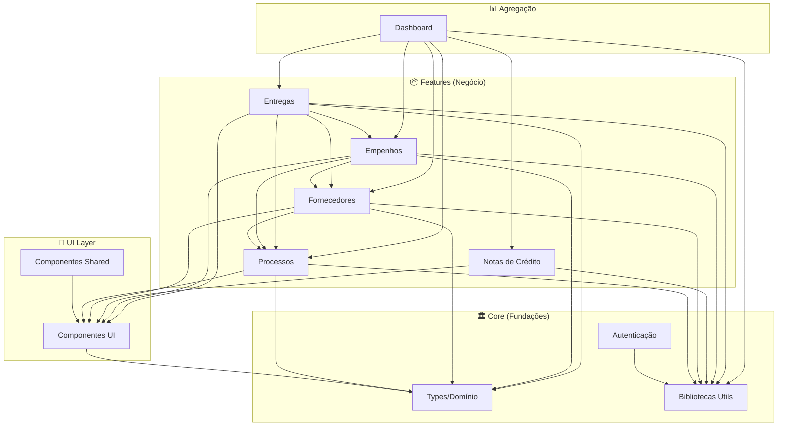

# 01 - PLANO DE ANÁLISE DETALHADA

## 📌 Visão Geral do Plano

Este documento define a estratégia e ordem de análise de todos os módulos do projeto **SGC-Gestão**.

**Princípio de Ordenação**: Analisar do núcleo (core) para a periferia, começando pelas fundações que outros módulos dependem.

---

## 🗂️ Divisão em Módulos de Análise

O projeto foi dividido em **10 módulos** principais para análise:

| # | Módulo | Arquivos | Complexidade | Prioridade |
|---|--------|----------|--------------|------------|
| 1 | Tipos e Domínio | 1 | 🟢 Baixa | 🔴 Crítica |
| 2 | Autenticação | 4 | 🟡 Média | 🔴 Crítica |
| 3 | Bibliotecas Utilitárias | 4 | 🟢 Baixa | 🟠 Alta |
| 4 | Componentes UI | 18 | 🟢 Baixa | 🟡 Média |
| 5 | Processos | 2 | 🟡 Média | 🟠 Alta |
| 6 | Fornecedores | 3 | 🟠 Média-Alta | 🟠 Alta |
| 7 | Notas de Crédito | 2 | 🟡 Média | 🟡 Média |
| 8 | Empenhos | 2 | 🟠 Média-Alta | 🟠 Alta |
| 9 | Entregas | 3 | 🔴 Alta | 🟠 Alta |
| 10 | Dashboard | 2 | 🟡 Média | 🟡 Média |

---

## 📊 Ordem de Análise Recomendada

### Fase 1: Fundações (Core)

#### 1️⃣ Tipos e Domínio
```
📦 Arquivos:
   └── src/types/index.ts (40 linhas)

🎯 Justificativa:
   - Define as entidades centrais do sistema (Processo, Fornecedor, ItemProcesso)
   - Todos os outros módulos dependem destes tipos
   - Base para entender o modelo de domínio
```

#### 2️⃣ Autenticação
```
📦 Arquivos:
   ├── src/providers/AuthProvider.tsx (92 linhas)
   ├── src/app/login/page.tsx
   ├── src/app/register/page.tsx
   └── src/app/pending/page.tsx

🎯 Justificativa:
   - Controla o acesso a toda a aplicação
   - Define o fluxo de aprovação de usuários
   - Pré-requisito para entender rotas protegidas
```

#### 3️⃣ Bibliotecas Utilitárias
```
📦 Arquivos:
   ├── src/app/lib/firebase.ts (19 linhas)
   ├── src/app/lib/formatters.ts (700 bytes)
   ├── src/app/lib/excel.ts (1.8 KB)
   └── src/app/lib/utils.ts (172 bytes)

🎯 Justificativa:
   - Funções reutilizadas em todos os módulos
   - Configuração do Firebase (conexão com banco)
   - Formatadores de dados (moeda, datas)
```

---

### Fase 2: Infraestrutura UI

#### 4️⃣ Componentes UI
```
📦 Arquivos (18 componentes):
   └── src/components/ui/
       ├── button.tsx, input.tsx, label.tsx
       ├── card.tsx, badge.tsx, avatar.tsx
       ├── dialog.tsx, sheet.tsx, dropdown-menu.tsx
       ├── select.tsx, checkbox.tsx, switch.tsx
       ├── table.tsx, tabs.tsx, progress.tsx
       ├── form.tsx, textarea.tsx, alert.tsx
   └── src/components/shared/
       ├── FilterBar.tsx
       └── PageHeader.tsx

🎯 Justificativa:
   - Primitivos usados em todos os formulários
   - Design System do projeto
   - Wrappers do Radix UI (padrão de composição)
```

---

### Fase 3: Módulos de Negócio (do simples ao complexo)

#### 5️⃣ Processos
```
📦 Arquivos:
   ├── src/app/(dashboard)/processos/page.tsx
   └── src/features/processos/components/ProcessoForm.tsx (205 linhas)

🎯 Justificativa:
   - Entidade central do sistema
   - Base para entender relacionamentos
   - Padrão CRUD que se repete em outros módulos
```

#### 6️⃣ Fornecedores
```
📦 Arquivos:
   ├── src/app/(dashboard)/fornecedores/page.tsx
   ├── src/features/fornecedores/components/FornecedorForm.tsx (333 linhas)
   └── src/features/fornecedores/components/ProcessoLinker.tsx

🎯 Justificativa:
   - Vinculação dinâmica com Processos
   - Padrão de relacionamento N:N
   - Validação de CNPJ
```

#### 7️⃣ Notas de Crédito
```
📦 Arquivos:
   ├── src/app/(dashboard)/ncs/page.tsx
   └── src/features/ncs/components/NCForm.tsx (233 linhas)

🎯 Justificativa:
   - Itens dinâmicos em formulário
   - Cálculos financeiros
   - Padrão de lista editável
```

#### 8️⃣ Empenhos
```
📦 Arquivos:
   ├── src/app/(dashboard)/empenhos/page.tsx
   └── src/features/empenhos/components/EmpenhoForm.tsx (423 linhas)

🎯 Justificativa:
   - Cálculos financeiros complexos
   - Relacionamento com Processos e Fornecedores
   - Validações de saldo
```

#### 9️⃣ Entregas
```
📦 Arquivos:
   ├── src/app/(dashboard)/entregas/page.tsx
   ├── src/features/entregas/components/EntregaWizard.tsx (703 linhas) ⚠️ MAIOR
   └── src/features/entregas/components/EntregaCard.tsx

🎯 Justificativa:
   - MÓDULO MAIS COMPLEXO
   - Wizard de 8 etapas com auto-save
   - Múltiplos status e transições
   - Última prioridade para ter contexto completo
```

---

### Fase 4: Agregação

#### 🔟 Dashboard
```
📦 Arquivos:
   ├── src/app/(dashboard)/page.tsx (401 linhas)
   └── src/app/(dashboard)/layout.tsx (152 linhas)

🎯 Justificativa:
   - Agrega dados de todos os módulos
   - Última análise para entender KPIs
   - Ponto de entrada visual do sistema
```

---

## 🔗 Mapa de Dependências



### Legenda de Dependências

| Módulo | Depende de |
|--------|------------|
| Autenticação | firebase.ts |
| Processos | Types, Libs, UI |
| Fornecedores | Types, Libs, Processos, UI |
| Notas de Crédito | Libs, UI |
| Empenhos | Types, Libs, Processos, Fornecedores, UI |
| Entregas | Types, Libs, Processos, Fornecedores, Empenhos, UI |
| Dashboard | Todos os módulos |

---

## ✅ Checklist de Progresso

### Etapa 1: Reconhecimento Inicial
- [x] Mapear estrutura de diretórios
- [x] Identificar tecnologias
- [x] Documentar arquitetura geral
- [x] Criar `00-VISAO-GERAL.md`

### Etapa 2: Plano de Análise
- [x] Dividir projeto em módulos
- [x] Definir ordem de prioridade
- [x] Mapear dependências
- [x] Criar `01-PLANO-DE-ANALISE.md`

### Etapa 3: Análise Detalhada por Módulo
- [ ] `02-TIPOS-E-DOMINIO.md` - Tipos e entidades
- [ ] `03-AUTENTICACAO.md` - Fluxo de auth
- [ ] `04-BIBLIOTECAS-UTILITARIAS.md` - Utils e helpers
- [ ] `05-COMPONENTES-UI.md` - Design System
- [ ] `06-PROCESSOS.md` - Módulo de processos
- [ ] `07-FORNECEDORES.md` - Módulo de fornecedores
- [ ] `08-NOTAS-DE-CREDITO.md` - Módulo de NCs
- [ ] `09-EMPENHOS.md` - Módulo de empenhos
- [ ] `10-ENTREGAS.md` - Módulo de entregas (⚠️ Mais complexo)
- [ ] `11-DASHBOARD.md` - Dashboard e agregações

### Etapa 4: Síntese Final
- [ ] Executive Summary
- [ ] Métricas consolidadas
- [ ] Pontos fortes e fracos
- [ ] Roadmap de melhorias
- [ ] Criar `99-RELATORIO-FINAL.md`

---

## 📅 Estimativa de Esforço

| Módulo | Arquivos | Linhas Est. | Tempo Est. |
|--------|----------|-------------|------------|
| Tipos e Domínio | 1 | ~40 | ⏱️ 5 min |
| Autenticação | 4 | ~300 | ⏱️ 15 min |
| Bibliotecas Utils | 4 | ~100 | ⏱️ 10 min |
| Componentes UI | 20 | ~800 | ⏱️ 20 min |
| Processos | 2 | ~400 | ⏱️ 15 min |
| Fornecedores | 3 | ~500 | ⏱️ 20 min |
| Notas de Crédito | 2 | ~400 | ⏱️ 15 min |
| Empenhos | 2 | ~600 | ⏱️ 20 min |
| Entregas | 3 | ~900 | ⏱️ 30 min |
| Dashboard | 2 | ~550 | ⏱️ 20 min |
| **TOTAL** | **43** | **~4.590** | **⏱️ ~3h** |

---

## 🔜 Próximo Passo

Pronto para iniciar a **Etapa 3: Análise Detalhada por Módulo**.

**Primeiro módulo a analisar:** Tipos e Domínio

| Atributo | Valor |
|----------|-------|
| **Módulo** | Tipos e Domínio |
| **Arquivo** | `src/types/index.ts` |
| **Linhas** | 40 |
| **Complexidade** | 🟢 Baixa |
| **Documento** | `02-TIPOS-E-DOMINIO.md` |

---

**Aguardo seu "PODE COMEÇAR" para iniciar a análise do módulo Tipos e Domínio.**
