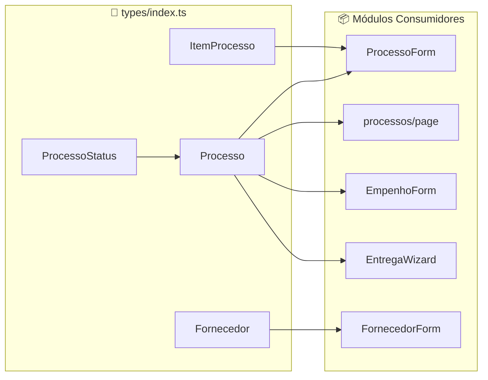

# 02 - TIPOS E DOMÍNIO - Análise Detalhada

## 1. Visão Geral

| Atributo | Valor |
|----------|-------|
| **Propósito** | Definir as entidades de domínio do sistema SGC-Gestão |
| **Responsabilidades** | Tipagem de Processos, Fornecedores e Itens de Processo |
| **Posição na Arquitetura** | 🏛️ **NÚCLEO** - Base para todos os módulos de negócio |

Este é o arquivo **mais importante** do sistema em termos de design, pois define o **modelo de domínio** que guia toda a aplicação.

---

## 2. Arquivos Analisados

| Arquivo | Caminho | Linhas | Bytes |
|---------|---------|--------|-------|
| **index.ts** | `src/types/index.ts` | 40 | 1.257 |

**Complexidade**: 🟢 Baixa (apenas definições de tipos)

---

## 3. Fluxo de Dados



**Direção do Fluxo**:
- Tipos são **exportados** deste arquivo
- Módulos de features **importam** os tipos
- Firestore recebe/retorna documentos tipados com estas interfaces

---

## 4. Definições Detalhadas

### 4.1 `ItemProcesso`
```typescript
// src/types/index.ts:1-6
export interface ItemProcesso {
    id: string;           // Identificador único do item
    descricao: string;    // Descrição textual do item
    quantidade: number;   // Quantidade solicitada
    valorUnitarioRef: number; // Valor unitário de referência (estimado)
}
```

| Campo | Tipo | Obrigatório | Propósito |
|-------|------|-------------|-----------|
| `id` | string | ✅ Sim | UUID único para identificar cada item na lista |
| `descricao` | string | ✅ Sim | Texto descritivo do material/serviço |
| `quantidade` | number | ✅ Sim | Quantidade a ser adquirida |
| `valorUnitarioRef` | number | ✅ Sim | Valor estimado para cálculo do processo |

**Uso**: Dentro do campo `itens` da interface `Processo`.

---

### 4.2 `ProcessoStatus`
```typescript
// src/types/index.ts:8
export type ProcessoStatus = 
    | "AGUARDANDO_FORNECEDOR"    // Início - aguardando vincular fornecedor
    | "AGUARDANDO_EMPENHO"       // Fornecedor vinculado, aguardando empenho
    | "AGUARDANDO_ENTREGA"       // Empenho feito, aguardando entrega
    | "AGUARDANDO_LIQUIDACAO"    // Entrega feita, aguardando pagamento
    | "AGUARDANDO_INICIO_ENTREGA"// Para remessa contínua
    | "AGUARDANDO_ENVIO_ARTE"    // Específico para materiais gráficos
    | "AGUARDANDO_APROVACAO_ARTE"// Arte enviada, aguardando aprovação
    | "EM_PRODUCAO"              // Material em fabricação
    | "ENVIADO"                  // Material despachado
    | "AGUARDANDO_RECEBIMENTO"   // Em trânsito
    | "EM_ANDAMENTO"             // Processo ativo genérico
    | "CONCLUIDO"                // Finalizado com sucesso
    | "ATIVO"                    // Status administrativo
    | "SUSPENSO"                 // Temporariamente pausado
    | "CANCELADO";               // Encerrado sem conclusão
```

**Diagrama de Estados**:
```
┌─────────────────────────────────────────────────────────────────────┐
│                        FLUXO PRINCIPAL                              │
├─────────────────────────────────────────────────────────────────────┤
│                                                                     │
│  ┌──────────────────┐    ┌──────────────────┐    ┌─────────────┐   │
│  │ AGUARDANDO_      │───▶│ AGUARDANDO_      │───▶│ AGUARDANDO_ │   │
│  │ FORNECEDOR       │    │ EMPENHO          │    │ ENTREGA     │   │
│  └──────────────────┘    └──────────────────┘    └──────┬──────┘   │
│                                                         │          │
│                                                         ▼          │
│                                                  ┌─────────────┐   │
│                                                  │ AGUARDANDO_ │   │
│                                                  │ LIQUIDACAO  │   │
│                                                  └──────┬──────┘   │
│                                                         │          │
│                                                         ▼          │
│                                                  ┌─────────────┐   │
│                                                  │ CONCLUIDO   │   │
│                                                  └─────────────┘   │
│                                                                     │
├─────────────────────────────────────────────────────────────────────┤
│                     FLUXO COM ARTES GRÁFICAS                        │
├─────────────────────────────────────────────────────────────────────┤
│                                                                     │
│  ┌──────────────────┐    ┌──────────────────┐    ┌─────────────┐   │
│  │ AGUARDANDO_      │───▶│ AGUARDANDO_      │───▶│ EM_PRODUCAO │   │
│  │ ENVIO_ARTE       │    │ APROVACAO_ARTE   │    │             │   │
│  └──────────────────┘    └──────────────────┘    └──────┬──────┘   │
│                                                         │          │
│                          ┌───────────────┐              │          │
│                          │ ENVIADO       │◀─────────────┘          │
│                          └───────┬───────┘                         │
│                                  │                                  │
│                                  ▼                                  │
│                          ┌───────────────┐                         │
│                          │ AGUARDANDO_   │                         │
│                          │ RECEBIMENTO   │                         │
│                          └───────────────┘                         │
│                                                                     │
├─────────────────────────────────────────────────────────────────────┤
│                      ESTADOS ADMINISTRATIVOS                        │
├─────────────────────────────────────────────────────────────────────┤
│                                                                     │
│  ┌────────┐    ┌──────────┐    ┌───────────┐                       │
│  │ ATIVO  │    │ SUSPENSO │    │ CANCELADO │                       │
│  └────────┘    └──────────┘    └───────────┘                       │
│     ▲              ▲                ▲                              │
│     └──────────────┴────────────────┘                              │
│         (Qualquer estado pode transicionar)                         │
└─────────────────────────────────────────────────────────────────────┘
```

**Total**: 15 status possíveis

---

### 4.3 `Processo`
```typescript
// src/types/index.ts:10-29
export interface Processo {
    // === IDENTIFICAÇÃO ===
    id?: string;              // ID do Firestore (opcional no create)
    numero: string;           // Número oficial do processo (ex: "PE 001/2024")
    
    // === CLASSIFICAÇÃO ===
    modalidade: "PREGAO" | "DISPENSA" | "ADESAO" | "INEXIGIBILIDADE";
    categoria: "MATERIAL" | "SERVICO";
    tipoFornecimento: "REMESSA_UNICA" | "REMESSA_CONTINUA";
    modo: "SIMPLES" | "DETALHADO";
    status: ProcessoStatus;
    
    // === DESCRIÇÃO ===
    objetoResumo: string;     // Descrição do objeto
    descricao?: string;       // Alias (duplicado)
    
    // === VALORES ===
    valorTotalEstimado?: number;
    valorTotal?: number;      // Alias (duplicado)
    itens?: ItemProcesso[];   // Lista de itens (modo DETALHADO)
    
    // === TIMESTAMPS ===
    dataCriacao: any;         // Timestamp do Firebase
    dataAtualizacao?: any;    // Timestamp de update
}
```

**Campos Detalhados**:

| Campo | Tipo | Obrigatório | Valores Possíveis | Descrição |
|-------|------|-------------|-------------------|-----------|
| `id` | string | ⚪ Não | UUID | Auto-gerado pelo Firestore |
| `numero` | string | ✅ Sim | "PE 001/2024" | Identificador humano |
| `modalidade` | enum | ✅ Sim | PREGAO, DISPENSA, ADESAO, INEXIGIBILIDADE | Tipo de licitação |
| `categoria` | enum | ✅ Sim | MATERIAL, SERVICO | Natureza da aquisição |
| `tipoFornecimento` | enum | ✅ Sim | REMESSA_UNICA, REMESSA_CONTINUA | Tipo de entrega |
| `modo` | enum | ✅ Sim | SIMPLES, DETALHADO | Com/sem itens |
| `status` | ProcessoStatus | ✅ Sim | 15 valores | Estado atual |
| `objetoResumo` | string | ✅ Sim | Texto livre | Descrição do processo |
| `valorTotalEstimado` | number | ⚪ Não | Decimal | Valor de referência |
| `itens` | ItemProcesso[] | ⚪ Não | Array | Lista de itens |
| `dataCriacao` | Timestamp | ✅ Sim | Firebase Timestamp | Data de criação |
| `dataAtualizacao` | Timestamp | ⚪ Não | Firebase Timestamp | Última alteração |

---

### 4.4 `Fornecedor`
```typescript
// src/types/index.ts:31-39
export interface Fornecedor {
    id?: string;              // ID do Firestore
    empresa: string;          // Razão social
    cnpj: string;             // CNPJ formatado
    telefone: string;         // Contato principal
    email?: string;           // Email de contato
    processosVinculados?: any[]; // Relacionamento N:N com Processos
    dataCadastro: any;        // Timestamp do Firebase
}
```

| Campo | Tipo | Obrigatório | Descrição |
|-------|------|-------------|-----------|
| `id` | string | ⚪ Não | ID do Firestore |
| `empresa` | string | ✅ Sim | Nome/Razão Social |
| `cnpj` | string | ✅ Sim | CNPJ formatado (XX.XXX.XXX/XXXX-XX) |
| `telefone` | string | ✅ Sim | Telefone de contato |
| `email` | string | ⚪ Não | Email opcional |
| `processosVinculados` | any[] | ⚪ Não | Array de IDs de processos |
| `dataCadastro` | Timestamp | ✅ Sim | Data de cadastro |

---

## 5. Dependências

### Módulos que Importam esses Tipos:

| Módulo | Arquivo | Tipos Usados |
|--------|---------|--------------|
| **Processos** | `ProcessoForm.tsx:6` | Processo, ItemProcesso |
| **Processos** | `processos/page.tsx` | Processo |
| **Empenhos** | `EmpenhoForm.tsx` | Processo (via seleção) |
| **Entregas** | `EntregaWizard.tsx` | Processo (via dados) |

### Dependências Externas:
- Nenhuma (arquivo puro de tipos)

---

## 6. Padrões e Boas Práticas

### ✅ Boas Práticas Identificadas

1. **Centralização de Tipos** - Todos os tipos em um único arquivo
2. **Union Types para Enums** - `ProcessoStatus`, `modalidade`, etc. usam union types
3. **Campos Opcionais Claros** - Uso consistente de `?` para campos não obrigatórios
4. **Naming Convention** - Nomes em português alinhados com o domínio

### ⚠️ Code Smells Encontrados

| Problema | Localização | Severidade | Descrição |
|----------|-------------|------------|-----------|
| **Tipagem `any`** | Linhas 27, 28, 37, 38 | 🟠 Média | `dataCriacao`, `dataAtualizacao`, `processosVinculados`, `dataCadastro` usam `any` |
| **Campos Duplicados (Alias)** | Linhas 15, 24 | 🟡 Baixa | `descricao` é alias de `objetoResumo`, `valorTotal` é alias de `valorTotalEstimado` |
| **Falta de Entidades** | - | 🟠 Média | Faltam interfaces para Empenho, NC, Entrega |

### 🔧 Sugestões de Melhoria

#### 1. Substituir `any` por tipos específicos
```typescript
// ❌ Atual
dataCriacao: any;
dataAtualizacao?: any;

// ✅ Sugerido
import { Timestamp } from "firebase/firestore";

dataCriacao: Timestamp;
dataAtualizacao?: Timestamp;
```

#### 2. Remover aliases duplicados
```typescript
// ❌ Atual
objetoResumo: string;
descricao?: string; // Alias para objetoResumo

// ✅ Sugerido - escolher um nome e usar somente ele
objetoResumo: string; // ou apenas "descricao"
```

#### 3. Adicionar interfaces faltantes
```typescript
// Sugestões de tipos que deveriam existir:

export interface Empenho {
    id?: string;
    numeroEmpenho: string;
    processoId: string;
    fornecedorId: string;
    valor: number;
    nd: string;
    status: "PENDENTE" | "EMITIDO" | "CANCELADO";
    dataCriacao: Timestamp;
}

export interface NotaCredito {
    id?: string;
    numero: string;
    creditos: CreditoItem[];
    status: "ATIVA" | "UTILIZADA";
    dataCriacao: Timestamp;
}

export interface Entrega {
    id?: string;
    empenhoId: string;
    status: EntregaStatus;
    etapaAtual: number;
    // ... demais campos do wizard
}
```

---

## 7. Testes

| Status | Descrição |
|--------|-----------|
| ⚠️ **Não há testes** | Arquivo de tipos não possui testes unitários |

**Recomendação**: Por ser apenas definição de tipos, testes não são críticos, mas podem ser úteis scripts de validação de schema para garantir compatibilidade com Firestore.

---

## 8. Segurança

| Aspecto | Status | Observação |
|---------|--------|------------|
| **Validação de CNPJ** | ⚠️ Não feita aqui | Validação deve ser feita no form |
| **Sanitização** | ⚠️ Não aplicável | Tipos não sanitizam dados |
| **Exposição de Dados** | ✅ OK | Tipos não expõem dados sensíveis |

**Nota**: A segurança de tipos é limitada em TypeScript pois tipos são apagados em runtime. Validação com Zod seria recomendada.

---

## 9. Performance

| Aspecto | Status | Impacto |
|---------|--------|---------|
| **Bundle Size** | ✅ Ótimo | Tipos são eliminados na build |
| **Memory** | ✅ Ótimo | Zero impacto em runtime |
| **Compile Time** | ✅ Ótimo | Arquivo pequeno (40 linhas) |

---

## 10. Documentação

| Aspecto | Status |
|---------|--------|
| **JSDoc** | ❌ Ausente |
| **Comentários inline** | ⚠️ Parcial (apenas aliases comentados) |
| **README do módulo** | ❌ Ausente |

**Exemplo de documentação sugerida**:
```typescript
/**
 * Representa um processo licitatório no sistema SGC.
 * 
 * @example
 * const processo: Processo = {
 *   numero: "PE 001/2024",
 *   modalidade: "PREGAO",
 *   objetoResumo: "Aquisição de material de escritório",
 *   categoria: "MATERIAL",
 *   tipoFornecimento: "REMESSA_UNICA",
 *   modo: "SIMPLES",
 *   status: "AGUARDANDO_FORNECEDOR",
 *   dataCriacao: serverTimestamp()
 * };
 */
export interface Processo {
    // ...
}
```

---

## 📋 Resumo da Análise

| Métrica | Valor |
|---------|-------|
| **Linhas de Código** | 40 |
| **Interfaces** | 3 (ItemProcesso, Processo, Fornecedor) |
| **Types** | 1 (ProcessoStatus) |
| **Enums Inline** | 4 (modalidade, categoria, tipoFornecimento, modo) |
| **Status Possíveis** | 15 |
| **Code Smells** | 3 |
| **Nível de Maturidade** | 🟡 Médio |

### Veredicto Final
O arquivo cumpre seu propósito de definir o modelo de domínio, mas pode ser melhorado com:
1. Tipagem mais rigorosa (eliminar `any`)
2. Remoção de aliases duplicados
3. Adição de tipos faltantes (Empenho, NC, Entrega)
4. Documentação com JSDoc

---

## 🔜 Próximo Módulo

**Módulo 2: Autenticação** (`AuthProvider.tsx` + páginas de login/register/pending)

Aguardo seu **"PODE COMEÇAR"** para prosseguir.
