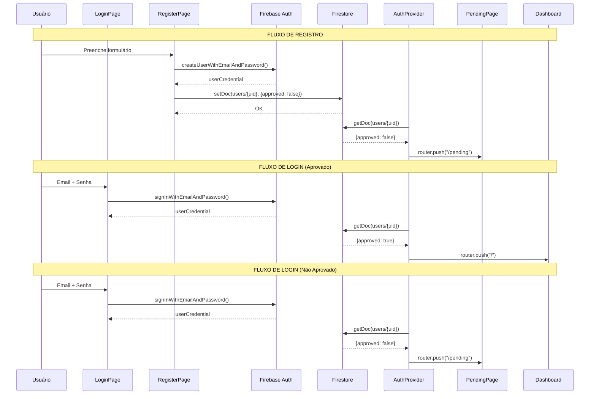

# 03 - AUTENTICAÇÃO - Análise Detalhada

## 1. Visão Geral

| Atributo | Valor |
|----------|-------|
| **Propósito** | Controlar acesso ao sistema com fluxo de aprovação manual |
| **Responsabilidades** | Login, Registro, Verificação de Aprovação, Proteção de Rotas |
| **Posição na Arquitetura** | 🔐 **INFRAESTRUTURA** - Camada de segurança que protege toda a aplicação |

O sistema implementa um fluxo de autenticação **com aprovação manual**, onde novos usuários precisam ser aprovados por um administrador antes de acessar o dashboard.

---

## 2. Arquivos Analisados

| Arquivo | Caminho | Linhas | Bytes | Propósito |
|---------|---------|--------|-------|-----------|
| **AuthProvider.tsx** | `src/providers/AuthProvider.tsx` | 92 | 3.108 | Provider central de autenticação |
| **login/page.tsx** | `src/app/login/page.tsx` | 128 | 5.842 | Página de login |
| **register/page.tsx** | `src/app/register/page.tsx` | 191 | 8.678 | Página de registro |
| **pending/page.tsx** | `src/app/pending/page.tsx` | 48 | 1.868 | Página de aguardando aprovação |
| **TOTAL** | - | **459** | **19.496** | - |

**Complexidade Geral**: 🟡 Média

---

## 3. Fluxo de Dados



### Diagrama de Estados do Usuário

```
                    ┌─────────────┐
                    │   INÍCIO    │
                    └──────┬──────┘
                           │
                           ▼
                    ┌─────────────┐      /register
                    │ Não Logado  │◄─────────────────┐
                    └──────┬──────┘                  │
                           │                         │
                   /login  │                         │
                           ▼                         │
               ┌───────────────────┐                 │
               │  Firebase Auth    │                 │
               │  (Autenticado)    │                 │
               └─────────┬─────────┘                 │
                         │                           │
          ┌──────────────┼──────────────┐           │
          ▼              │              ▼           │
   ┌─────────────┐       │       ┌─────────────┐    │
   │  approved:  │       │       │  approved:  │    │
   │    false    │       │       │    true     │    │
   └──────┬──────┘       │       └──────┬──────┘    │
          │              │              │           │
          ▼              │              ▼           │
   ┌─────────────┐       │       ┌─────────────┐    │
   │  /pending   │       │       │  Dashboard  │    │
   │  (Espera)   │       │       │     (/)     │    │
   └──────┬──────┘       │       └─────────────┘    │
          │              │                          │
          │   Logout     │                          │
          └──────────────┴──────────────────────────┘
```

---

## 4. Funções/Métodos Principais

### 4.1 `AuthProvider` (Componente)

```typescript
// src/providers/AuthProvider.tsx:10-92
export function AuthProvider({ children }: { children: React.ReactNode })
```

| Aspecto | Detalhes |
|---------|----------|
| **Localização** | `AuthProvider.tsx:10-92` |
| **Parâmetros** | `children: React.ReactNode` - Componentes filhos a serem envolvidos |
| **Retorno** | `JSX.Element` - Loading spinner ou children |
| **Props** | Nenhuma |

#### Estados Internos

| Estado | Tipo | Inicial | Propósito |
|--------|------|---------|-----------|
| `user` | `User \| null` | `null` | Usuário do Firebase Auth |
| `loading` | `boolean` | `true` | Indica carregamento inicial |
| `isApproved` | `boolean` | `false` | Status de aprovação |

#### Lógica Interna (Passo a Passo)

```typescript
// 1. Inscrever-se em mudanças de autenticação
useEffect(() => {
    const unsubscribe = onAuthStateChanged(auth, async (currentUser) => {
        if (currentUser) {
            // 2. Buscar documento do usuário no Firestore
            const userRef = doc(db, "users", currentUser.uid);
            const userSnap = await getDoc(userRef);
            
            // 3. Verificar campo "approved"
            if (userSnap.exists() && userSnap.data().approved === true) {
                setIsApproved(true);
            } else {
                setIsApproved(false);
            }
            setUser(currentUser);
        } else {
            // 4. Sem usuário logado
            setUser(null);
            setIsApproved(false);
        }
        setLoading(false);
    });
    
    // 5. Timeout de segurança (5 segundos)
    const timeout = setTimeout(() => setLoading(false), 5000);
    
    return () => { unsubscribe(); clearTimeout(timeout); };
}, []);
```

#### Lógica de Redirecionamento

```typescript
// src/providers/AuthProvider.tsx:57-78
useEffect(() => {
    if (loading) return;
    
    const publicPages = ["/login", "/register"];
    const isPublicPage = publicPages.includes(pathname);
    const isPendingPage = pathname === "/pending";
    
    // REGRA 1: Não logado → Login
    if (!user && !isPublicPage) {
        router.push("/login");
    }
    // REGRA 2: Logado mas não aprovado → Pending
    else if (user && !isApproved && !isPendingPage) {
        router.push("/pending");
    }
    // REGRA 3: Aprovado tentando ir para Login/Pending → Dashboard
    else if (user && isApproved && (isPublicPage || isPendingPage)) {
        router.push("/");
    }
}, [user, isApproved, loading, pathname, router]);
```

| Condição | Destino |
|----------|---------|
| `!user && !isPublicPage` | `/login` |
| `user && !isApproved && !isPendingPage` | `/pending` |
| `user && isApproved && (isPublicPage \|\| isPendingPage)` | `/` |

---

### 4.2 `handleLogin` (Função)

```typescript
// src/app/login/page.tsx:20-42
const handleLogin = async (e: React.FormEvent) => {...}
```

| Aspecto | Detalhes |
|---------|----------|
| **Localização** | `login/page.tsx:20-42` |
| **Parâmetros** | `e: React.FormEvent` - Evento do formulário |
| **Retorno** | `Promise<void>` |
| **Efeitos** | Login no Firebase, redirecionamento automático via AuthProvider |

#### Tratamento de Erros

| Código Firebase | Mensagem para Usuário |
|-----------------|----------------------|
| `auth/invalid-credential` | "Email ou senha incorretos" |
| `auth/wrong-password` | "Email ou senha incorretos" |
| `auth/user-not-found` | "Usuário não encontrado" |
| `auth/invalid-email` | "Email inválido" |
| Outros | "Erro ao fazer login. Tente novamente." |

---

### 4.3 `handleRegister` (Função)

```typescript
// src/app/register/page.tsx:23-73
const handleRegister = async (e: React.FormEvent) => {...}
```

| Aspecto | Detalhes |
|---------|----------|
| **Localização** | `register/page.tsx:23-73` |
| **Parâmetros** | `e: React.FormEvent` - Evento do formulário |
| **Retorno** | `Promise<void>` |

#### Validações Locais

| Validação | Condição | Mensagem |
|-----------|----------|----------|
| Senhas | `password !== confirmPassword` | "As senhas não coincidem" |
| Tamanho senha | `password.length < 6` | "A senha deve ter pelo menos 6 caracteres" |
| Nome vazio | `!name.trim()` | "Por favor, insira seu nome" |

#### Estrutura do Documento Criado

```typescript
// src/app/register/page.tsx:51-57
await setDoc(doc(db, "users", user.uid), {
    name: name.trim(),
    email: email,
    approved: false,      // ⚠️ CRÍTICO: Inicia como NÃO aprovado
    createdAt: new Date(),
    role: "user"
});
```

---

### 4.4 `handleLogout` (Função)

```typescript
// src/app/pending/page.tsx:12-15
const handleLogout = async () => {
    await signOut(auth);
    router.push("/login");
};
```

| Aspecto | Detalhes |
|---------|----------|
| **Localização** | `pending/page.tsx:12-15` |
| **Complexidade** | O(1) - Simples chamada ao Firebase |

---

## 5. Dependências

### Dependências Externas

| Biblioteca | Importações | Propósito |
|------------|-------------|-----------|
| `firebase/auth` | `signInWithEmailAndPassword`, `createUserWithEmailAndPassword`, `signOut`, `onAuthStateChanged`, `User` | Autenticação |
| `firebase/firestore` | `doc`, `setDoc`, `getDoc` | Dados do usuário |
| `next/navigation` | `useRouter`, `usePathname` | Navegação |
| `lucide-react` | `Loader2`, `ShieldCheck`, `UserPlus`, `ShieldAlert`, `LogOut` | Ícones |

### Dependências Internas

| Módulo | Importação | Uso |
|--------|------------|-----|
| `@/app/lib/firebase` | `auth`, `db` | Instâncias Firebase |
| `@/components/ui/button` | `Button` | Botões |
| `@/components/ui/input` | `Input` | Campos de texto |
| `@/components/ui/label` | `Label` | Labels acessíveis |

---

## 6. Padrões e Boas Práticas

### ✅ Boas Práticas Identificadas

| Prática | Localização | Descrição |
|---------|-------------|-----------|
| **Provider Pattern** | `AuthProvider.tsx` | Centraliza lógica de autenticação |
| **Route Guards** | `AuthProvider.tsx:57-78` | Proteção automática de rotas |
| **Safety Timeout** | `AuthProvider.tsx:46-49` | Evita loading infinito |
| **Error Handling** | `login/page.tsx:28-41` | Mensagens amigáveis por código |
| **Form Validation** | `register/page.tsx:27-41` | Validação antes de submit |
| **Disabled UI** | Todos | Inputs desabilitados durante loading |
| **Visual Feedback** | Todos | Spinner durante operações |

### ⚠️ Code Smells Encontrados

| Problema | Localização | Severidade | Descrição |
|----------|-------------|------------|-----------|
| **`any` em catch** | `login/page.tsx:28`, `register/page.tsx:60` | 🟡 Baixa | Erro tipado como `any` |
| **Falta de Context** | `AuthProvider.tsx` | 🟠 Média | Não expõe `user`/`isApproved` via Context API |
| **Hardcoded timeout** | `AuthProvider.tsx:47` | 🟡 Baixa | 5000ms deveria ser configurável |
| **Sem "Esqueci senha"** | `login/page.tsx` | 🟡 Baixa | Funcionalidade comum ausente |
| **Sem verificação de email** | `register/page.tsx` | 🟠 Média | Email não verificado ao registrar |

### 🔧 Sugestões de Melhoria

#### 1. Criar Context para expor estado de autenticação
```typescript
// ❌ Atual: Não expõe estado
export function AuthProvider({ children }: { children: React.ReactNode }) {
    return <>{children}</>;
}

// ✅ Sugerido: Expor via Context
const AuthContext = createContext<{
    user: User | null;
    isApproved: boolean;
    loading: boolean;
} | null>(null);

export function useAuth() {
    const context = useContext(AuthContext);
    if (!context) throw new Error("useAuth must be used within AuthProvider");
    return context;
}

export function AuthProvider({ children }: { children: React.ReactNode }) {
    // ... estados existentes ...
    return (
        <AuthContext.Provider value={{ user, isApproved, loading }}>
            {children}
        </AuthContext.Provider>
    );
}
```

#### 2. Tipar corretamente erros do Firebase
```typescript
// ❌ Atual
} catch (err: any) {
    if (err.code === "auth/invalid-credential") ...
}

// ✅ Sugerido
import { FirebaseError } from "firebase/app";

} catch (err) {
    if (err instanceof FirebaseError) {
        switch (err.code) {
            case "auth/invalid-credential":
                setError("Email ou senha incorretos");
                break;
            // ...
        }
    }
}
```

#### 3. Adicionar recuperação de senha
```typescript
// Novo arquivo: src/app/forgot-password/page.tsx
import { sendPasswordResetEmail } from "firebase/auth";

const handleForgotPassword = async (email: string) => {
    await sendPasswordResetEmail(auth, email);
};
```

---

## 7. Testes

| Status | Descrição |
|--------|-----------|
| ❌ **Não há testes** | Módulo de autenticação não possui testes unitários |

### Casos de Teste Recomendados

| Cenário | Tipo | Prioridade |
|---------|------|------------|
| Login com credenciais válidas | Integração | 🔴 Alta |
| Login com credenciais inválidas | Unitário | 🔴 Alta |
| Registro com usuário novo | Integração | 🔴 Alta |
| Registro com email duplicado | Unitário | 🟠 Média |
| Redirecionamento usuário não-aprovado | E2E | 🔴 Alta |
| Redirecionamento usuário aprovado | E2E | 🔴 Alta |
| Timeout de loading | Unitário | 🟡 Baixa |

---

## 8. Segurança

| Aspecto | Status | Observação |
|---------|--------|------------|
| **Senha mínima** | ✅ OK | 6 caracteres (regra Firebase) |
| **Validação local de senha** | ✅ OK | Verificação antes de enviar |
| **Aprovação manual** | ✅ OK | Proteção contra contas não autorizadas |
| **Proteção de rotas** | ✅ OK | AuthProvider bloqueia acesso |
| **Rate limiting** | ⚠️ Parcial | Depende do Firebase (não configurado) |
| **Verificação de email** | ❌ Ausente | Recomendado implementar |
| **2FA** | ❌ Ausente | Não implementado |
| **Sanitização** | ⚠️ Parcial | `name.trim()` mas sem sanitização XSS |

### Vulnerabilidades Potenciais

| Risco | Severidade | Mitigação |
|-------|------------|-----------|
| Enumeração de usuários | 🟡 Baixa | Mensagens genéricas já implementadas |
| Brute force | 🟠 Média | Implementar rate limiting |
| Conta sem email verificado | 🟠 Média | Adicionar `sendEmailVerification()` |

---

## 9. Performance

| Métrica | Status | Observação |
|---------|--------|------------|
| **Bundle Size** | ✅ OK | Firebase Auth carregado sob demanda |
| **Loading inicial** | ⚠️ Médio | Timeout de 5s pode parecer lento |
| **Redirecionamentos** | ✅ OK | Client-side, sem flicker |
| **Revalidação** | ✅ OK | Listener `onAuthStateChanged` é eficiente |

### Gargalo Identificado
O **loading inicial** pode levar até 5 segundos se o Firebase demorar. Considerar:
- Reduzir timeout para 3 segundos
- Adicionar skeleton loading progressivo

---

## 10. Documentação

| Aspecto | Status |
|---------|--------|
| **JSDoc** | ❌ Ausente |
| **Comentários inline** | ⚠️ Parcial (alguns comentários explicativos) |
| **README do módulo** | ❌ Ausente |

### Comentários Existentes

| Localização | Comentário |
|-------------|------------|
| `AuthProvider.tsx:5` | `// Mantendo seu caminho de importação` |
| `AuthProvider.tsx:20` | `// Usuário logado, agora vamos verificar se ele está APROVADO` |
| `AuthProvider.tsx:46` | `// Safety timeout: If Firebase takes too long` |
| `AuthProvider.tsx:57` | `// Lógica do "Porteiro" (Redirecionamentos)` |
| `register/page.tsx:54` | `// IMPORTANTE: novo usuário NÃO está aprovado` |

---

## 📋 Resumo da Análise

| Métrica | Valor |
|---------|-------|
| **Linhas de Código** | 459 |
| **Arquivos** | 4 |
| **Funções Principais** | 4 |
| **Estados** | 3 (user, loading, isApproved) |
| **Rotas** | 3 (/login, /register, /pending) |
| **Code Smells** | 5 |
| **Vulnerabilidades** | 3 |
| **Nível de Maturidade** | 🟡 Médio |

### Veredicto Final

O módulo de autenticação é **funcional e seguro para uso básico**, com destaque para:
- ✅ Fluxo de aprovação manual (diferencial de segurança)
- ✅ Proteção de rotas automática
- ✅ UX com feedback visual

Porém, pode ser melhorado com:
- Exposição do estado via Context API
- Verificação de email
- Funcionalidade de "Esqueci minha senha"
- Testes automatizados

---

## 🔜 Próximo Módulo

**Módulo 3: Bibliotecas Utilitárias** (`firebase.ts`, `formatters.ts`, `excel.ts`, `utils.ts`)

Aguardo seu **"PODE COMEÇAR"** para prosseguir.
