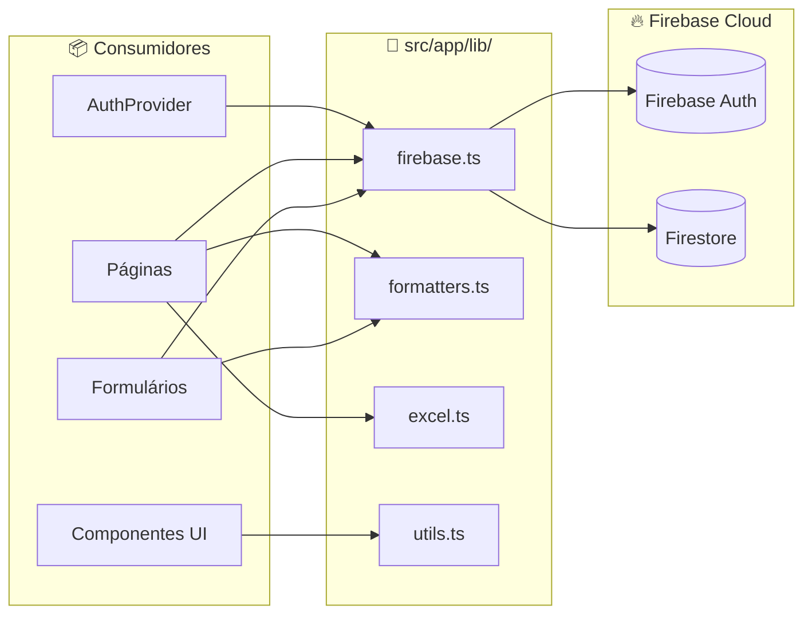

# 04 - BIBLIOTECAS UTILITÁRIAS - Análise Detalhada

## 1. Visão Geral

| Atributo | Valor |
|----------|-------|
| **Propósito** | Fornecer funções utilitárias reutilizáveis em toda a aplicação |
| **Responsabilidades** | Configuração Firebase, formatação de dados, exportação Excel, utilitários CSS |
| **Posição na Arquitetura** | 🔧 **INFRAESTRUTURA** - Camada de serviços usada por todos os módulos |

---

## 2. Arquivos Analisados

| Arquivo | Caminho | Linhas | Bytes | Propósito |
|---------|---------|--------|-------|-----------|
| **firebase.ts** | `src/app/lib/firebase.ts` | 19 | 783 | Configuração do Firebase |
| **formatters.ts** | `src/app/lib/formatters.ts` | 18 | 700 | Formatadores de dados |
| **excel.ts** | `src/app/lib/excel.ts` | 60 | 1.853 | Exportação para Excel |
| **utils.ts** | `src/app/lib/utils.ts` | 7 | 172 | Utilitários CSS (Tailwind) |
| **TOTAL** | - | **104** | **3.508** | - |

**Complexidade Geral**: 🟢 Baixa

---

## 3. Fluxo de Dados



---

## 4. Funções/Métodos Detalhados

---

### 4.1 📁 `firebase.ts` - Configuração Firebase

```typescript
// src/app/lib/firebase.ts (19 linhas)
```

#### Configuração Exportada

| Constante | Tipo | Descrição |
|-----------|------|-----------|
| `app` | `FirebaseApp` | Instância da aplicação Firebase |
| `auth` | `Auth` | Serviço de autenticação |
| `db` | `Firestore` | Banco de dados Firestore |

#### Implementação do Singleton

```typescript
// Linha 15 - Padrão Singleton
const app = !getApps().length ? initializeApp(firebaseConfig) : getApp();
```

| Condição | Ação |
|----------|------|
| `!getApps().length` (primeira vez) | Inicializa novo app |
| `getApps().length > 0` (já existe) | Retorna app existente |

#### Variáveis de Ambiente Utilizadas

| Variável | Prefixo | Obrigatória |
|----------|---------|-------------|
| `NEXT_PUBLIC_FIREBASE_API_KEY` | `NEXT_PUBLIC_` | ✅ Sim |
| `NEXT_PUBLIC_FIREBASE_AUTH_DOMAIN` | `NEXT_PUBLIC_` | ✅ Sim |
| `NEXT_PUBLIC_FIREBASE_PROJECT_ID` | `NEXT_PUBLIC_` | ✅ Sim |
| `NEXT_PUBLIC_FIREBASE_STORAGE_BUCKET` | `NEXT_PUBLIC_` | ✅ Sim |
| `NEXT_PUBLIC_FIREBASE_MESSAGING_SENDER_ID` | `NEXT_PUBLIC_` | ✅ Sim |
| `NEXT_PUBLIC_FIREBASE_APP_ID` | `NEXT_PUBLIC_` | ✅ Sim |

> ⚠️ **Nota**: Prefixo `NEXT_PUBLIC_` expõe variáveis no cliente (necessário para Firebase SDK).

---

### 4.2 📁 `formatters.ts` - Formatadores

#### `formatMoney(value)`

```typescript
// src/app/lib/formatters.ts:1-5
export const formatMoney = (value: number | string) => {
  const num = parseFloat(value.toString());
  if (isNaN(num)) return "R$ 0,00";
  return new Intl.NumberFormat('pt-BR', { 
    style: 'currency', 
    currency: 'BRL' 
  }).format(num);
};
```

| Aspecto | Detalhes |
|---------|----------|
| **Parâmetros** | `value: number \| string` |
| **Retorno** | `string` formatada como moeda BR |
| **Edge Case** | `NaN` retorna `"R$ 0,00"` |
| **Complexidade** | O(1) |

**Exemplos**:
| Input | Output |
|-------|--------|
| `1234.56` | `"R$ 1.234,56"` |
| `"1000"` | `"R$ 1.000,00"` |
| `"abc"` | `"R$ 0,00"` |
| `0` | `"R$ 0,00"` |

---

#### `formatCNPJ(value)`

```typescript
// src/app/lib/formatters.ts:7-10
export const formatCNPJ = (value: string) => {
  if (!value) return "";
  return value.replace(
    /^(\d{2})(\d{3})(\d{3})(\d{4})(\d{2})/, 
    "$1.$2.$3/$4-$5"
  );
};
```

| Aspecto | Detalhes |
|---------|----------|
| **Parâmetros** | `value: string` (apenas dígitos) |
| **Retorno** | `string` formatada como CNPJ |
| **Edge Case** | Valor vazio retorna `""` |

**Exemplos**:
| Input | Output |
|-------|--------|
| `"12345678000199"` | `"12.345.678/0001-99"` |
| `""` | `""` |

---

#### `formatPhone(value)`

```typescript
// src/app/lib/formatters.ts:12-18
export const formatPhone = (value: string) => {
  if (!value) return "";
  const v = value.replace(/\D/g, "");
  if (v.length === 11) return v.replace(/^(\d{2})(\d{5})(\d{4})/, "($1) $2-$3");
  if (v.length === 10) return v.replace(/^(\d{2})(\d{4})(\d{4})/, "($1) $2-$3");
  return value;
};
```

| Aspecto | Detalhes |
|---------|----------|
| **Parâmetros** | `value: string` |
| **Retorno** | `string` formatada como telefone BR |

**Exemplos**:
| Input | Dígitos | Output |
|-------|---------|--------|
| `"11999998888"` | 11 | `"(11) 99999-8888"` |
| `"1133334444"` | 10 | `"(11) 3333-4444"` |
| `"123"` | 3 | `"123"` (sem formatação) |

---

### 4.3 📁 `excel.ts` - Exportação Excel

#### `exportToExcel(data, fileName)`

```typescript
// src/app/lib/excel.ts:3-60
export const exportToExcel = (data: any[], fileName: string) => {...}
```

| Aspecto | Detalhes |
|---------|----------|
| **Parâmetros** | `data: any[]` - Array de objetos, `fileName: string` - Nome do arquivo |
| **Retorno** | `void` - Faz download do arquivo |
| **Biblioteca** | `xlsx-js-style` |

#### Fluxo de Execução

```
1. Validar dados → 2. Criar planilha → 3. Estilizar → 4. Download
```

#### Estilos Aplicados

**Cabeçalho (Linha 1)**:
```typescript
const headerStyle = {
  font: { bold: true, color: { rgb: "FFFFFF" }, sz: 12 },
  fill: { fgColor: { rgb: "2E7D32" } }, // Verde escuro
  alignment: { horizontal: "center", vertical: "center" },
  border: { /* bordas finas */ }
};
```

**Células de Dados**:
```typescript
const cellStyle = {
  border: { /* bordas finas */ },
  alignment: { vertical: "center" }
};
```

#### Auto-fit de Colunas

```typescript
// Linha 53
const colWidths = headers.map(h => ({ wch: Math.max(h.length + 5, 20) }));
```
Largura = `max(tamanho_header + 5, 20)` caracteres.

---

### 4.4 📁 `utils.ts` - Utilitários CSS

#### `cn(...inputs)`

```typescript
// src/app/lib/utils.ts:4-6
export function cn(...inputs: ClassValue[]) {
  return twMerge(clsx(inputs))
}
```

| Aspecto | Detalhes |
|---------|----------|
| **Parâmetros** | `...inputs: ClassValue[]` - Classes CSS variádicas |
| **Retorno** | `string` - Classes mescladas sem conflitos |
| **Bibliotecas** | `clsx` + `tailwind-merge` |

**Funcionamento**:
1. `clsx()` - Concatena classes condicionalmente
2. `twMerge()` - Remove conflitos de Tailwind (ex: `p-2` e `p-4` → `p-4`)

**Exemplo**:
```typescript
cn("bg-red-500", condition && "bg-blue-500", "p-2", "p-4")
// Se condition = true → "bg-blue-500 p-4"
// Se condition = false → "bg-red-500 p-4"
```

---

## 5. Dependências

### Externas

| Biblioteca | Versão | Uso |
|------------|--------|-----|
| `firebase` | 12.6.0 | Auth + Firestore |
| `xlsx-js-style` | 1.2.0 | Exportação Excel com estilos |
| `clsx` | 2.1.1 | Concatenação de classes |
| `tailwind-merge` | 3.4.0 | Merge de classes Tailwind |

### Internas
Nenhuma (são módulos base).

---

## 6. Padrões e Boas Práticas

### ✅ Boas Práticas

| Prática | Localização | Descrição |
|---------|-------------|-----------|
| **Singleton Pattern** | `firebase.ts:15` | Evita múltiplas instâncias Firebase |
| **Variáveis de Ambiente** | `firebase.ts:6-11` | Configuração externa |
| **Intl API** | `formatters.ts:4` | Formatação i18n nativa |
| **Guard Clauses** | `formatters.ts:3,8,13` | Validação de entrada |
| **Função Pura** | `utils.ts:cn` | Sem efeitos colaterais |

### ⚠️ Code Smells

| Problema | Localização | Severidade | Descrição |
|----------|-------------|------------|-----------|
| **Tipagem `any[]`** | `excel.ts:3` | 🟡 Baixa | Data não tipada |
| **`alert()` no código** | `excel.ts:5` | 🟠 Média | Deveria retornar erro ou throw |
| **Falta validação CNPJ** | `formatters.ts:7-10` | 🟡 Baixa | Apenas formata, não valida |

### 🔧 Sugestões de Melhoria

#### 1. Tipar dados do Excel
```typescript
// ❌ Atual
export const exportToExcel = (data: any[], fileName: string) => {...}

// ✅ Sugerido
export const exportToExcel = <T extends Record<string, unknown>>(
  data: T[], 
  fileName: string
) => {...}
```

#### 2. Substituir alert por exceção
```typescript
// ❌ Atual
if (!data || data.length === 0) {
  alert("Não há dados para exportar.");
  return;
}

// ✅ Sugerido
if (!data || data.length === 0) {
  throw new Error("Não há dados para exportar.");
}
```

#### 3. Adicionar validação de CNPJ
```typescript
// Adicionar nova função
export const isValidCNPJ = (cnpj: string): boolean => {
  const cleaned = cnpj.replace(/\D/g, '');
  if (cleaned.length !== 14) return false;
  // Implementar validação dos dígitos verificadores
  // ...
  return true;
};
```

---

## 7. Testes

| Status | Descrição |
|--------|-----------|
| ❌ **Não há testes** | Nenhum teste unitário para os formatadores |

### Casos de Teste Recomendados

| Função | Caso | Prioridade |
|--------|------|------------|
| `formatMoney` | Valores positivos/negativos/zero/NaN | 🟠 Média |
| `formatCNPJ` | CNPJ válido/inválido/parcial | 🟠 Média |
| `formatPhone` | 10/11 dígitos/formatação parcial | 🟠 Média |
| `exportToExcel` | Array vazio/preenchido | 🟡 Baixa |
| `cn` | Classes conflitantes/condicionais | 🟢 Baixa |

---

## 8. Segurança

| Aspecto | Status | Observação |
|---------|--------|------------|
| **Variáveis expostas** | ⚠️ Atenção | `NEXT_PUBLIC_*` são visíveis no cliente (esperado para Firebase) |
| **XSS em formatadores** | ✅ OK | Retornam strings puras, sem HTML |
| **Injeção em Excel** | ✅ OK | `xlsx-js-style` sanitiza dados |

---

## 9. Performance

| Arquivo | Status | Observação |
|---------|--------|------------|
| `firebase.ts` | ✅ OK | Singleton evita re-inicialização |
| `formatters.ts` | ✅ OK | Funções O(1) |
| `excel.ts` | ⚠️ Atenção | Loop aninhado O(n*m) - OK para tabelas pequenas |
| `utils.ts` | ✅ OK | Operação O(n) onde n = número de classes |

---

## 10. Documentação

| Aspecto | Status |
|---------|--------|
| **JSDoc** | ❌ Ausente |
| **Comentários inline** | ⚠️ Parcial (apenas em excel.ts) |

---

## 📋 Resumo da Análise

| Métrica | Valor |
|---------|-------|
| **Linhas de Código** | 104 |
| **Arquivos** | 4 |
| **Funções Exportadas** | 5 |
| **Dependências Externas** | 4 bibliotecas |
| **Code Smells** | 3 |
| **Nível de Maturidade** | 🟢 Bom |

### Veredicto Final

O módulo é **bem estruturado e funcional** para o propósito atual. Melhorias recomendadas:
1. Tipagem mais rigorosa no exportador Excel
2. Substituir `alert()` por tratamento de erro adequado
3. Adicionar testes unitários para formatadores

---

## 🔜 Próximo Módulo

**Módulo 4: Componentes UI** (`src/components/ui/` - 18 arquivos)

Aguardo seu **"OK"** para prosseguir.
