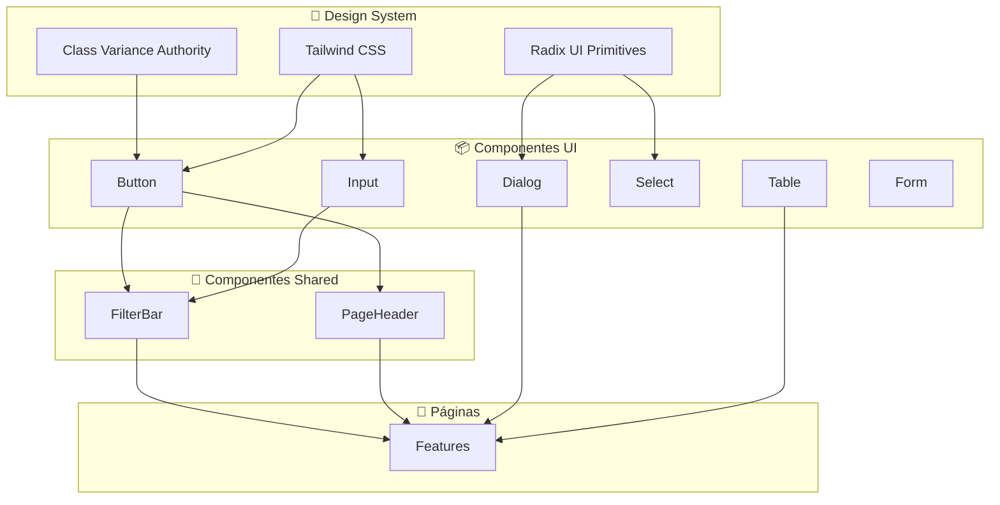

# 05 - COMPONENTES UI - Análise Detalhada

## 1. Visão Geral

| Atributo | Valor |
|----------|-------|
| **Propósito** | Fornecer Design System consistente baseado em Radix UI |
| **Responsabilidades** | Componentes primitivos reutilizáveis para toda a aplicação |
| **Posição na Arquitetura** | 🎨 **CAMADA DE APRESENTAÇÃO** - Base visual do sistema |

---

## 2. Arquivos Analisados

### Componentes UI Primitivos (`src/components/ui/`)

| Componente | Linhas | Bytes | Base Radix |
|------------|--------|-------|------------|
| `button.tsx` | 61 | 2.206 | Slot |
| `input.tsx` | 22 | 987 | - |
| `label.tsx` | ~20 | 639 | Label |
| `card.tsx` | 93 | 2.083 | - |
| `dialog.tsx` | 145 | 4.232 | Dialog |
| `select.tsx` | 188 | 6.518 | Select |
| `table.tsx` | 117 | 2.564 | - |
| `form.tsx` | 168 | 3.930 | Label + Slot |
| `dropdown-menu.tsx` | ~200 | 8.679 | DropdownMenu |
| `sheet.tsx` | ~120 | 4.233 | Dialog |
| `tabs.tsx` | ~60 | 2.039 | Tabs |
| `checkbox.tsx` | ~40 | 1.252 | Checkbox |
| `switch.tsx` | ~40 | 1.212 | Switch |
| `avatar.tsx` | ~40 | 1.154 | Avatar |
| `badge.tsx` | ~40 | 1.279 | - |
| `progress.tsx` | ~25 | 775 | Progress |
| `textarea.tsx` | ~25 | 781 | - |
| `alert.tsx` | ~50 | 1.684 | - |
| **TOTAL UI** | **~1.454** | **~46KB** | - |

### Componentes Shared (`src/components/shared/`)

| Componente | Linhas | Bytes | Propósito |
|------------|--------|-------|-----------|
| `FilterBar.tsx` | 54 | 1.806 | Barra de pesquisa e filtros |
| `PageHeader.tsx` | 30 | 1.070 | Cabeçalho padrão de páginas |
| **TOTAL SHARED** | **84** | **2.876** | - |

**Complexidade Geral**: 🟢 Baixa (wrappers padronizados)

---

## 3. Padrão Arquitetural



---

## 4. Componentes Principais Detalhados

### 4.1 `Button` - Componente com Variantes

```typescript
// src/components/ui/button.tsx:7-37
const buttonVariants = cva(
  "inline-flex items-center justify-center...",
  {
    variants: {
      variant: {
        default: "bg-primary text-primary-foreground hover:bg-primary/90",
        destructive: "bg-destructive text-white hover:bg-destructive/90",
        outline: "border bg-background shadow-xs hover:bg-accent",
        secondary: "bg-secondary text-secondary-foreground",
        ghost: "hover:bg-accent hover:text-accent-foreground",
        link: "text-primary underline-offset-4 hover:underline",
      },
      size: {
        default: "h-9 px-4 py-2",
        sm: "h-8 rounded-md gap-1.5 px-3",
        lg: "h-10 rounded-md px-6",
        icon: "size-9",
        "icon-sm": "size-8",
        "icon-lg": "size-10",
      },
    },
    defaultVariants: { variant: "default", size: "default" },
  }
)
```

| Variante | Uso |
|----------|-----|
| `default` | Ações primárias (Salvar) |
| `destructive` | Ações perigosas (Excluir) |
| `outline` | Ações secundárias (Cancelar) |
| `ghost` | Menu lateral, ações sutis |
| `link` | Links textuais |

---

### 4.2 `Dialog` - Modal Customizado

```typescript
// src/components/ui/dialog.tsx:50-82
function DialogContent({
  className,
  children,
  showCloseButton = true,  // ✅ Customização própria
  ...props
}: ...)
```

**Customizações do Projeto**:
- `showCloseButton` - Prop extra para ocultar botão X
- `backdrop-blur-md` - Blur no overlay (linha 42)
- Animações de entrada/saída

---

### 4.3 `Select` - Dropdown Estilizado

| Subcomponente | Propósito |
|---------------|-----------|
| `Select` | Root container |
| `SelectTrigger` | Botão que abre |
| `SelectValue` | Valor selecionado |
| `SelectContent` | Lista de opções |
| `SelectItem` | Cada opção |
| `SelectScrollUpButton` | Scroll para cima |
| `SelectScrollDownButton` | Scroll para baixo |

**Customização do Projeto** (linha 65):
```typescript
className="bg-slate-950 text-slate-200 border-slate-800..."
```

---

### 4.4 `Form` - Integração React Hook Form

```typescript
// Componentes do sistema de formulários:
Form          // FormProvider do RHF
FormField     // Controller + Context
FormItem      // Container de campo
FormLabel     // Label com estado de erro
FormControl   // Slot para input
FormDescription // Texto de ajuda
FormMessage   // Mensagem de erro
```

**Hook Customizado**:
```typescript
// src/components/ui/form.tsx:45-66
const useFormField = () => {
  const fieldContext = useContext(FormFieldContext);
  const { getFieldState } = useFormContext();
  // Retorna: id, name, formItemId, error, etc.
}
```

---

### 4.5 `FilterBar` - Componente Shared

```typescript
// src/components/shared/FilterBar.tsx:9-18
interface FilterBarProps {
  searchValue: string;
  onSearchChange: (value: string) => void;
  searchPlaceholder?: string;
  filterValue: string;
  onFilterChange: (value: any) => void;
  options: FilterOption[];
}
```

**Funcionalidades**:
- Campo de busca com ícone
- Filtros por pills (botões redondos)
- Scroll horizontal para filtros

---

### 4.6 `PageHeader` - Componente Shared

```typescript
// src/components/shared/PageHeader.tsx:4-9
interface PageHeaderProps {
  title: string;
  description: string;
  onExport?: () => void;       // Botão Excel opcional
  children?: React.ReactNode;   // Slot para botão "Novo"
}
```

**Padrão de Uso**:
```tsx
<PageHeader 
  title="Processos" 
  description="Gerenciar processos licitatórios"
  onExport={handleExport}
>
  <Button>+ Novo Processo</Button>
</PageHeader>
```

---

## 5. Dependências

### Externas

| Biblioteca | Componentes que Usam |
|------------|---------------------|
| `@radix-ui/react-dialog` | Dialog, Sheet |
| `@radix-ui/react-select` | Select |
| `@radix-ui/react-dropdown-menu` | DropdownMenu |
| `@radix-ui/react-checkbox` | Checkbox |
| `@radix-ui/react-switch` | Switch |
| `@radix-ui/react-tabs` | Tabs |
| `@radix-ui/react-avatar` | Avatar |
| `@radix-ui/react-progress` | Progress |
| `@radix-ui/react-label` | Label, Form |
| `@radix-ui/react-slot` | Button, Form |
| `class-variance-authority` | Button, Badge |
| `lucide-react` | Ícones em todos |

### Internas

| Importação | Uso |
|------------|-----|
| `@/app/lib/utils` | Função `cn()` em todos |

---

## 6. Padrões e Boas Práticas

### ✅ Boas Práticas

| Prática | Descrição |
|---------|-----------|
| **Compound Components** | Select, Dialog, etc. usam composição |
| **Forwarding Refs** | Todos usam `React.ComponentProps` |
| **CVA para Variantes** | Button usa class-variance-authority |
| **data-slot** | Atributos para testes e debugging |
| **Acessibilidade** | Radix garante ARIA compliance |
| **Tailwind Merge** | `cn()` evita conflitos de classes |

### ⚠️ Code Smells

| Problema | Localização | Severidade |
|----------|-------------|------------|
| **Cor hardcoded** | `select.tsx:65` (`bg-slate-950`) | 🟡 Baixa |
| **Comentário em português no código** | `dialog.tsx:41` | 🟢 Mínima |
| **Tipagem `any`** | `FilterBar.tsx:16` (`onFilterChange`) | 🟡 Baixa |

---

## 7. Testes

| Status | Descrição |
|--------|-----------|
| ❌ **Não há testes** | Componentes UI não possuem testes |

**Nota**: Radix UI é bem testado internamente, então testes unitários são menos críticos para wrappers simples.

---

## 8. Segurança

| Aspecto | Status |
|---------|--------|
| **XSS** | ✅ React escapa conteúdo por padrão |
| **ARIA** | ✅ Radix implementa acessibilidade |

---

## 9. Performance

| Aspecto | Status | Observação |
|---------|--------|------------|
| **Tree Shaking** | ✅ OK | Imports individuais |
| **Bundle Size** | ⚠️ Atenção | Radix adiciona ~30KB gzipped |
| **Re-renders** | ✅ OK | Componentes primitivos puros |

---

## 10. Documentação

| Aspecto | Status |
|---------|--------|
| **JSDoc** | ❌ Ausente |
| **Storybook** | ❌ Ausente |
| **Props documentadas** | ⚠️ Via TypeScript apenas |

---

## 📋 Resumo da Análise

| Métrica | Valor |
|---------|-------|
| **Componentes UI** | 18 |
| **Componentes Shared** | 2 |
| **Total de Linhas** | ~1.538 |
| **Bibliotecas Radix** | 10 |
| **Nível de Maturidade** | 🟢 Bom |

### Veredicto Final

O Design System é **bem implementado** seguindo padrões modernos:
- ✅ Radix UI garante acessibilidade
- ✅ CVA permite variantes type-safe
- ✅ Componentes compostos facilitam uso

Melhorias recomendadas:
1. Usar CSS variables ao invés de cores hardcoded
2. Tipar melhor props de callbacks
3. Considerar Storybook para documentação visual

---

## 🔜 Próximo Módulo

**Módulo 5: Processos** (`processos/page.tsx` + `ProcessoForm.tsx`)

Aguardo seu **"OK"** para prosseguir.
