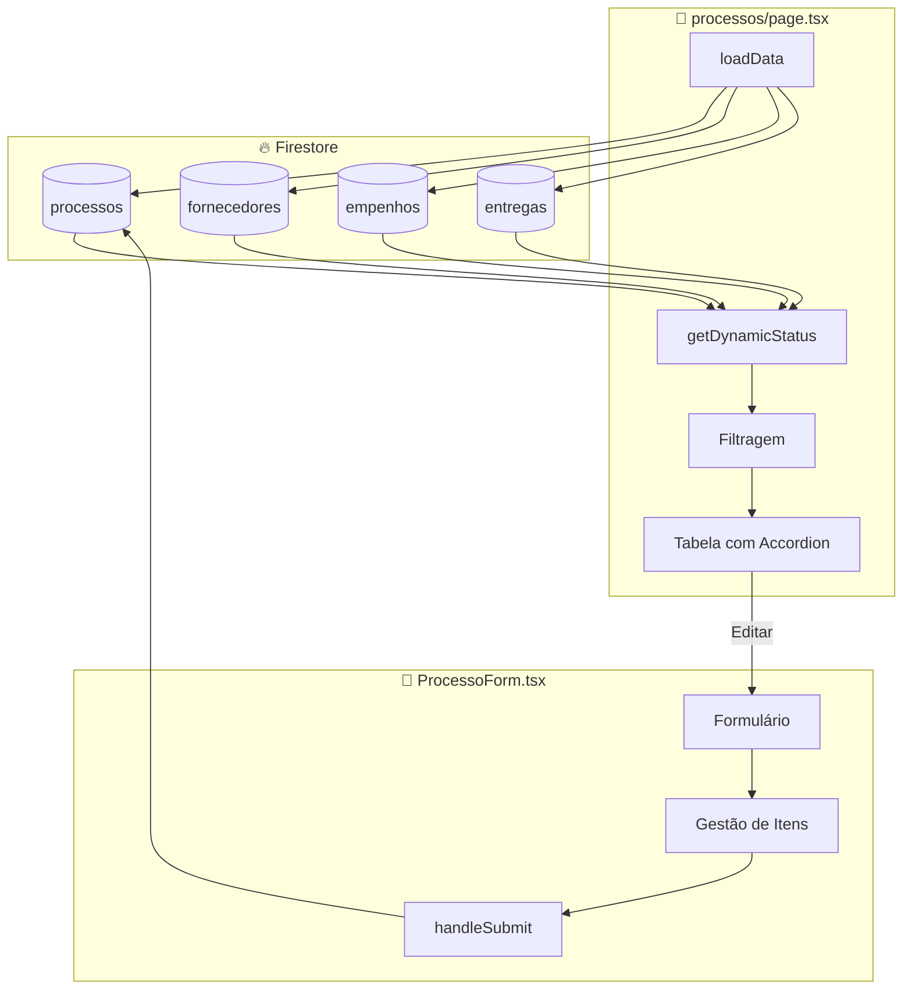

# 06 - PROCESSOS - Análise Detalhada

## 1. Visão Geral

| Atributo | Valor |
|----------|-------|
| **Propósito** | Gerenciar processos licitatórios (Pregão, Dispensa, Adesão, Inexigibilidade) |
| **Responsabilidades** | CRUD de processos, cálculo de status dinâmico, gestão de itens |
| **Posição na Arquitetura** | 📦 **CORE BUSINESS** - Entidade central do sistema |

O módulo de Processos é o **coração do sistema SGC**, sendo a entidade que conecta Fornecedores, Empenhos e Entregas.

---

## 2. Arquivos Analisados

| Arquivo | Caminho | Linhas | Bytes |
|---------|---------|--------|-------|
| **page.tsx** | `src/app/(dashboard)/processos/page.tsx` | 372 | 20.648 |
| **ProcessoForm.tsx** | `src/features/processos/components/ProcessoForm.tsx` | 205 | 10.757 |
| **TOTAL** | - | **577** | **31.405** |

**Complexidade**: 🟡 Média

---

## 3. Fluxo de Dados



---

## 4. Funções/Métodos Principais

### 4.1 `loadData()` - Carregamento de Dados

```typescript
// src/app/(dashboard)/processos/page.tsx:31-59
const loadData = async () => {
    // 1. Fetch Processos
    const pSnap = await getDocs(collection(db, "processos"));
    // 2. Fetch Fornecedores
    const fSnap = await getDocs(collection(db, "fornecedores"));
    // 3. Fetch Empenhos
    const eSnap = await getDocs(collection(db, "empenhos"));
    // 4. Fetch Entregas
    const entSnap = await getDocs(collection(db, "entregas"));
}
```

| Aspecto | Detalhes |
|---------|----------|
| **Complexidade** | O(n) para cada coleção |
| **Chamadas Firebase** | 4 queries paralelas implícitas |
| **Performance** | ⚠️ Carrega TODOS os dados de 4 coleções |

---

### 4.2 `getDynamicStatus()` - Cálculo de Status Dinâmico

```typescript
// src/app/(dashboard)/processos/page.tsx:66-95
const getDynamicStatus = (p: Processo) => {
    // 1. Mantém CANCELADO/SUSPENSO
    if (p.status === "CANCELADO" || p.status === "SUSPENSO") return p.status;
    
    // 2. Verifica Fornecedores → AGUARDANDO_FORNECEDOR
    // 3. Verifica Empenhos → AGUARDANDO_EMPENHO
    // 4. Verifica Entregas → status intermediários
    // 5. Todas concluídas → CONCLUIDO
    // 6. Default → EM_ANDAMENTO
}
```

**Fluxo de Status**:
```
AGUARDANDO_FORNECEDOR → AGUARDANDO_EMPENHO → AGUARDANDO_INICIO_ENTREGA
                                                     ↓
    ┌────────────────────────────────────────────────┤
    ↓                                                ↓
AGUARDANDO_ENVIO_ARTE → AGUARDANDO_APROVACAO_ARTE → EM_PRODUCAO
                                                     ↓
                                              ENVIADO
                                                     ↓
                                         AGUARDANDO_RECEBIMENTO
                                                     ↓
                                              CONCLUIDO
```

---

### 4.3 `ProcessoForm` - Formulário CRUD

```typescript
// src/features/processos/components/ProcessoForm.tsx:22-205
export function ProcessoForm({ onSuccess, dataToEdit }: ProcessoFormProps)
```

**Estados do Formulário**:

| Estado | Tipo | Descrição |
|--------|------|-----------|
| `numero` | string | Número do processo |
| `modalidade` | enum | PREGAO, DISPENSA, ADESAO, INEXIGIBILIDADE |
| `objeto` | string | Descrição do processo |
| `categoria` | enum | MATERIAL, SERVICO |
| `tipoFornecimento` | enum | REMESSA_UNICA, REMESSA_CONTINUA |
| `status` | ProcessoStatus | Status inicial |
| `isDetalhado` | boolean | Modo de cadastro |
| `valorTotal` | string | Valor global (modo simples) |
| `itens` | ItemProcesso[] | Lista de itens (modo detalhado) |

**Modos de Cadastro**:
| Modo | Campos |
|------|--------|
| **Simples** | Valor total estimado único |
| **Detalhado** | Lista de itens com descrição, qtd, valor ref |

---

### 4.4 `handleSubmit()` - Salvamento

```typescript
// src/features/processos/components/ProcessoForm.tsx:66-102
const handleSubmit = async (e: React.FormEvent) => {
    const payload = {
        numero, modalidade, objetoResumo: objeto,
        categoria, tipoFornecimento, status,
        modo: isDetalhado ? "DETALHADO" : "SIMPLES",
        dataAtualizacao: new Date(),
        ...(isDetalhado ? { itens } : { valorTotalEstimado })
    };
    
    if (!dataToEdit) {
        await addDoc(collection(db, "processos"), payload);
    } else {
        await updateDoc(doc(db, "processos", dataToEdit.id), payload);
    }
}
```

---

### 4.5 Gestão de Itens

| Função | Linha | Descrição |
|--------|-------|-----------|
| `handleAddItem()` | 54-56 | Adiciona item com UUID |
| `handleRemoveItem()` | 58-60 | Remove item por ID |
| `updateItem()` | 62-64 | Atualiza campo específico do item |

**Estrutura de Item**:
```typescript
{
    id: crypto.randomUUID(),
    descricao: "",
    quantidade: 1,
    valorUnitarioRef: 0
}
```

---

## 5. UI/UX Features

### 5.1 Tabela com Accordion

```tsx
// Linha expandida com detalhes do processo
{isExpanded && (
    <tr className="bg-slate-950/50 animate-in fade-in">
        <td colSpan={6}>
            // Categoria, Fornecimento
            // Cards de valores: Total, Ganho, Empenhado, Liquidado
            // Contadores: Empresas, Empenhos
            // Tabela de itens (toggle)
        </td>
    </tr>
)}
```

### 5.2 Cálculos Exibidos

| Métrica | Cálculo |
|---------|---------|
| **Total Inicial** | `Σ (item.qtd × item.valorRef)` |
| **Total Ganho** | `Σ (fornecedor.itens.valorGanho × qtd)` |
| **Total Empenhado** | `Σ empenhos.valorEmpenhado` |
| **Empresas Vinculadas** | `count(fornecedores com vínculo)` |
| **Empenhos Emitidos** | `count(empenhos do processo)` |

---

## 6. Dependências

### Externas
| Biblioteca | Uso |
|------------|-----|
| `firebase/firestore` | CRUD de dados |
| `lucide-react` | Plus, Edit, Trash2, ChevronDown, etc. |

### Internas
| Módulo | Componentes |
|--------|-------------|
| `@/components/ui` | Button, Dialog, Input, Select, Switch, Table |
| `@/components/shared` | PageHeader, FilterBar |
| `@/app/lib` | firebase, formatters, excel |
| `@/types` | Processo, ItemProcesso |

---

## 7. Padrões e Boas Práticas

### ✅ Boas Práticas

| Prática | Localização |
|---------|-------------|
| **Status Dinâmico** | Calcula status baseado em entidades relacionadas |
| **Modo Detalhado/Simples** | Flexibilidade no cadastro |
| **UUID para Itens** | `crypto.randomUUID()` garante IDs únicos |
| **Accordion UI** | Detalhes sem sair da listagem |
| **Filtros de Status** | ATIVOS, CONCLUÍDOS, TODOS |

### ⚠️ Code Smells

| Problema | Localização | Severidade |
|----------|-------------|------------|
| **Tipagem `any[]`** | page.tsx:18-20 (listas) | 🟠 Média |
| **Cálculos inline** | page.tsx:199-217 | 🟡 Baixa |
| **`alert()` / `confirm()`** | page.tsx:82, 98, 104 | 🟠 Média |
| **Payload com `any`** | ProcessoForm.tsx:71 | 🟡 Baixa |
| **Carrega tudo na mount** | page.tsx:31-59 | 🟠 Média |

### 🔧 Sugestões de Melhoria

#### 1. Extrair cálculos para funções
```typescript
// ❌ Atual - cálculos inline no JSX
const valorTotal = proc.itens?.reduce(...);
const totalGanho = fornecedoresList.reduce(...);

// ✅ Sugerido - funções utilitárias
function calcularValorTotal(proc: Processo): number {...}
function calcularTotalGanho(proc: Processo, fornecedores: Fornecedor[]): number {...}
```

#### 2. Tipar listas corretamente
```typescript
// ❌ Atual
const [fornecedoresList, setFornecedoresList] = useState<any[]>([]);

// ✅ Sugerido
const [fornecedoresList, setFornecedoresList] = useState<Fornecedor[]>([]);
```

#### 3. Substituir alert/confirm por modais
```typescript
// ❌ Atual
if (!confirm("Tem certeza?")) return;
alert("Processo criado com sucesso!");

// ✅ Sugerido - usar Dialog de confirmação
<ConfirmDialog onConfirm={handleDelete} />
<Toast message="Processo criado!" />
```

---

## 8. Testes

| Status | Descrição |
|--------|-----------|
| ❌ **Não há testes** | Módulo sem testes automatizados |

**Casos de Teste Recomendados**:
| Cenário | Tipo | Prioridade |
|---------|------|------------|
| Criar processo modo Simples | Integração | 🔴 Alta |
| Criar processo modo Detalhado | Integração | 🔴 Alta |
| Editar processo existente | Integração | 🔴 Alta |
| Cálculo de status dinâmico | Unitário | 🔴 Alta |
| Adicionar/remover itens | Unitário | 🟠 Média |
| Filtros funcionando | E2E | 🟠 Média |

---

## 9. Segurança

| Aspecto | Status |
|---------|--------|
| **Deleção sem soft-delete** | ⚠️ Exclui permanentemente |
| **Sem validação backend** | ⚠️ Apenas validação client-side |
| **Sem auditoria** | ⚠️ Não registra quem alterou |

---

## 10. Performance

| Aspecto | Status | Observação |
|---------|--------|------------|
| **Carregamento inicial** | ⚠️ Lento | 4 queries de todas as coleções |
| **Recálculo de status** | ⚠️ A cada render | `getDynamicStatus` em cada item |
| **Lista de itens** | ✅ OK | Scroll limitado a 300px |

**Sugestão**: Implementar paginação ou filtros server-side para grandes volumes.

---

## 📋 Resumo da Análise

| Métrica | Valor |
|---------|-------|
| **Linhas de Código** | 577 |
| **Arquivos** | 2 |
| **Estados do Form** | 10 |
| **Funções Principais** | 8 |
| **Cálculos Dinâmicos** | 5 |
| **Code Smells** | 5 |
| **Nível de Maturidade** | 🟡 Médio |

### Veredicto Final

O módulo é **funcional e bem estruturado** para o propósito, com destaque para:
- ✅ Status dinâmico calculado automaticamente
- ✅ Modo Detalhado/Simples flexível
- ✅ UI com accordion informativo

Melhorias prioritárias:
1. Tipagem forte das listas
2. Substituir alerts nativos por modais
3. Extrair lógica de cálculos para funções

---

## 🔜 Próximo Módulo

**Módulo 6: Fornecedores** (`fornecedores/page.tsx` + `FornecedorForm.tsx` + `ProcessoLinker.tsx`)

Aguardo seu **"OK"** para prosseguir.
