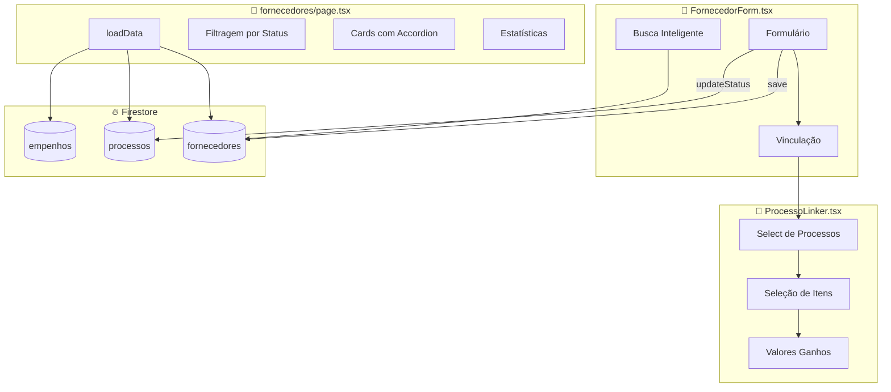

# 07 - FORNECEDORES - Análise Detalhada

## 1. Visão Geral

| Atributo | Valor |
|----------|-------|
| **Propósito** | Gerenciar fornecedores (empresas) e vincular a processos licitatórios |
| **Responsabilidades** | CRUD de fornecedores, vinculação N:N com processos, controle de itens ganhos |
| **Posição na Arquitetura** | 📦 **CORE BUSINESS** - Relacionamento central entre processos e empenhos |

O módulo de Fornecedores é um dos mais complexos do sistema, implementando:
- Busca inteligente por CNPJ/Nome
- Vinculação dinâmica a processos
- Controle de itens já ocupados por outros fornecedores

---

## 2. Arquivos Analisados

| Arquivo | Caminho | Linhas | Bytes |
|---------|---------|--------|-------|
| **page.tsx** | `src/app/(dashboard)/fornecedores/page.tsx` | 432 | 29.079 |
| **FornecedorForm.tsx** | `src/features/fornecedores/components/FornecedorForm.tsx` | 333 | 15.020 |
| **ProcessoLinker.tsx** | `src/features/fornecedores/components/ProcessoLinker.tsx` | 165 | 9.499 |
| **TOTAL** | - | **930** | **53.598** |

**Complexidade**: 🟠 Média-Alta

---

## 3. Fluxo de Dados



---

## 4. Funções/Métodos Principais

### 4.1 `performSearch()` - Busca Inteligente

```typescript
// src/features/fornecedores/components/FornecedorForm.tsx:45-70
const performSearch = useCallback(async (field: string, value: string) => {
    if (!value || value.length < 4) return;
    if (existingId) return; // Já encontrou
    
    const q = query(collection(db, "fornecedores"), where(field, "==", value));
    const snap = await getDocs(q);
    
    if (!snap.empty) {
        setExistingId(snap.docs[0].id);
        // Preenche campos automaticamente
    }
}, [existingId, empresa, cnpj]);
```

**Triggers**:
- Ao digitar CNPJ (>= 14 caracteres, debounce 800ms)
- Ao digitar Nome (>= 4 caracteres, debounce 1000ms)

---

### 4.2 Mapeamento de Itens Ocupados

```typescript
// src/features/fornecedores/components/FornecedorForm.tsx:104-119
const ocupadosMap: Record<string, Set<string>> = {};

fSnap.docs.forEach(doc => {
    const data = doc.data();
    if (data.processosVinculados) {
        data.processosVinculados.forEach((v: any) => {
            if (!ocupadosMap[v.processoId]) {
                ocupadosMap[v.processoId] = new Set();
            }
            v.itens?.forEach((i: any) => ocupadosMap[v.processoId].add(i.itemId));
        });
    }
});
```

**Estrutura**:
```typescript
{
    "processoId1": Set(["itemId1", "itemId2"]),
    "processoId2": Set(["itemId3"])
}
```

---

### 4.3 `handleSave()` - Salvamento com Vinculação

```typescript
// src/features/fornecedores/components/FornecedorForm.tsx:186-253
const handleSave = async (e: React.FormEvent) => {
    const itensSalvar = Object.keys(itensGanhos)
        .filter(key => itensGanhos[key].selecionado)
        .map(key => ({ itemId: key, valorGanho: itensGanhos[key].valorGanho }));
    
    if (existingId) {
        // ATUALIZAR
        await updateDoc(docRef, {
            ...payloadBase,
            processosVinculados: arrayUnion({
                processoId: selectedProc,
                itens: itensSalvar,
                tipoFornecimento, modalidade
            })
        });
        
        // Atualiza status do processo → AGUARDANDO_EMPENHO
        if (procStatus === "AGUARDANDO_FORNECEDOR") {
            await updateDoc(procRef, { status: "AGUARDANDO_EMPENHO" });
        }
    } else {
        // CRIAR
        await addDoc(collection(db, "fornecedores"), {...});
    }
}
```

---

### 4.4 `ProcessoLinker` - Componente de Vinculação

| Prop | Tipo | Descrição |
|------|------|-----------|
| `selectedProc` | string | ID do processo selecionado |
| `listaDropdown` | any[] | Processos disponíveis |
| `itensDisponiveis` | any[] | Itens do processo |
| `itensOcupados` | Set<string> | IDs de itens já vinculados |
| `itensGanhos` | Record | Seleção e valores |

**Features**:
- Filtra processos com itens disponíveis
- Mostra badge "JÁ VINCULADO" em itens ocupados
- Input de valor ganho por item

---

### 4.5 Estatísticas na Listagem

```typescript
// page.tsx:215-232 - Cálculo por fornecedor
processosVinculadosIds.forEach((pid) => {
    const empenhadoNeste = empenhosList
        .filter(e => e.id_fornecedor === f.id && e.id_processo === pid)
        .reduce((acc, curr) => acc + parseFloat(curr.valorEmpenhado) || 0, 0);
    
    if (p.status === "CONCLUIDO") { concluidos++; }
    else {
        if (empenhadoNeste === 0) disponiveis++;
        else emAndamento++;
    }
});
```

| Métrica | Cor | Descrição |
|---------|-----|-----------|
| Processos | Branco | Total vinculados |
| Disponíveis | Amarelo | Sem empenho ainda |
| Em Execução | Azul | Com empenho ativo |
| Concluídos | Verde | Status finalizado |

---

## 5. UI/UX Features

### 5.1 Cards com Accordion Duplo

```
┌─────────────────────────────────────────────┐
│ EMPRESA X                           [📝][🗑️]│
│ CNPJ: 00.000.000/0001-00                    │
│ [📞 Telefone] [📧 Email]                    │
├─────────────────────────────────────────────┤
│ 5 Processos │ 2 Disponíveis │ 2 Em Exec │ 1 │
└─────────┬───────────────────────────────────┘
          ▼ (expandido)
    ┌─────────────────────────────────────┐
    │ PREGÃO 001/2024                     │
    │ Objeto resumido...                  │
    │ Empenhado: R$ 5.000                 │
    │ [Ver Itens] ◄── accordion 2º nível  │
    └─────────────────────────────────────┘
```

### 5.2 Máscara de CNPJ

```typescript
// FornecedorForm.tsx:144-152
const handleCnpjChange = (e) => {
    let value = e.target.value.replace(/\D/g, '');
    value = value.replace(/^(\d{2})(\d)/, "$1.$2");
    value = value.replace(/^(\d{2})\.(\d{3})(\d)/, "$1.$2.$3");
    value = value.replace(/\.(\d{3})(\d)/, ".$1/$2");
    value = value.replace(/(\d{4})(\d)/, "$1-$2");
    setCnpj(value);
};
// Output: 00.000.000/0000-00
```

---

## 6. Dependências

### Internas
| Módulo | Componentes |
|--------|-------------|
| `@/components/ui` | Button, Input, Select, Table, Checkbox, Dialog |
| `@/components/shared` | PageHeader, FilterBar |
| `@/app/lib` | firebase, formatters, excel |

### Relações com Outras Entidades
| Entidade | Tipo de Relação |
|----------|-----------------|
| Processos | N:N (via processosVinculados) |
| Empenhos | 1:N (id_fornecedor) |

---

## 7. Padrões e Boas Práticas

### ✅ Boas Práticas

| Prática | Descrição |
|---------|-----------|
| **Busca Inteligente** | Auto-complete por CNPJ/Nome |
| **Debounce** | 800-1000ms para evitar requests excessivos |
| **Mapeamento de Ocupação** | Controla itens já vinculados |
| **arrayUnion** | Firebase merge sem duplicatas |
| **Atualização de Status** | Muda processo para AGUARDANDO_EMPENHO |

### ⚠️ Code Smells

| Problema | Localização | Severidade |
|----------|-------------|------------|
| **Tipagem `any`** | page.tsx:17,20,29,30 | 🟠 Média |
| **Tipagem `any`** | FornecedorForm.tsx:13,24,42 | 🟠 Média |
| **`alert()` nativo** | page.tsx:66,80,84 | 🟡 Baixa |
| **Cálculos inline** | page.tsx:202-232 | 🟡 Baixa |
| **Componente grande** | page.tsx (432 linhas) | 🟠 Média |

### 🔧 Sugestões de Melhoria

#### 1. Extrair componente FornecedorCard
```typescript
// ❌ Atual - tudo em page.tsx
fornecedoresFiltrados.map((f) => {
    // ... 200+ linhas de JSX ...
})

// ✅ Sugerido
<FornecedorCard 
    fornecedor={f}
    empenhos={empenhosList}
    processoMap={processoMap}
    onEdit={handleEdit}
    onDelete={handleDelete}
/>
```

#### 2. Tipar corretamente as entidades
```typescript
// ❌ Atual
const [fornecedores, setFornecedores] = useState<any[]>([]);

// ✅ Sugerido
interface FornecedorComVinculos extends Fornecedor {
    processosVinculados: VinculoProcesso[];
}
const [fornecedores, setFornecedores] = useState<FornecedorComVinculos[]>([]);
```

---

## 8. Testes

| Status | Descrição |
|--------|-----------|
| ❌ **Não há testes** | Módulo sem cobertura |

**Casos de Teste Prioritários**:
| Cenário | Tipo | Prioridade |
|---------|------|------------|
| Busca por CNPJ existente | Integração | 🔴 Alta |
| Vincular processo a fornecedor | Integração | 🔴 Alta |
| Filtro de itens ocupados | Unitário | 🟠 Média |
| Máscara de CNPJ | Unitário | 🟢 Baixa |

---

## 9. Segurança

| Aspecto | Status |
|---------|--------|
| **Validação CNPJ** | ⚠️ Apenas máscara, sem validação |
| **Deleção permanente** | ⚠️ Sem soft-delete |
| **Auditoria** | ❌ Não registra alterações |

---

## 10. Performance

| Aspecto | Status | Observação |
|---------|--------|------------|
| **Debounce** | ✅ OK | 800-1000ms na busca |
| **Carregamento** | ⚠️ Lento | 3 coleções completas |
| **Cálculos** | ⚠️ A cada render | Stats no JSX |

---

## 📋 Resumo da Análise

| Métrica | Valor |
|---------|-------|
| **Linhas de Código** | 930 |
| **Arquivos** | 3 |
| **Estados no Form** | 12+ |
| **Funções Principais** | 10 |
| **Code Smells** | 5 |
| **Nível de Maturidade** | 🟡 Médio |

### Veredicto Final

O módulo é **funcional e robusto**, com destaque para:
- ✅ Busca inteligente por CNPJ/Nome
- ✅ Controle de itens ocupados
- ✅ Atualização automática de status

Melhorias prioritárias:
1. Tipagem forte para evitar `any`
2. Extrair componentes (FornecedorCard)
3. Adicionar validação real de CNPJ

---

## 🔜 Próximo Módulo

**Módulo 7: Notas de Crédito** (`ncs/page.tsx` + `NCForm.tsx`)

Aguardo seu **"OK"** para prosseguir.
