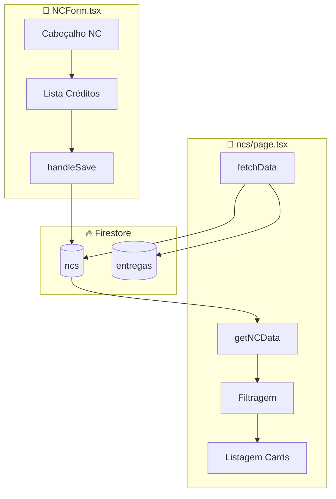

# 08 - NOTAS DE CRÉDITO - Análise Detalhada

## 1. Visão Geral

| Atributo | Valor |
|----------|-------|
| **Propósito** | Gerenciar Notas de Crédito orçamentárias recebidas |
| **Responsabilidades** | CRUD de NCs, múltiplos créditos por nota, controle de saldo |
| **Posição na Arquitetura** | 💰 **FINANCEIRO** - Origem do orçamento para empenhos |

As Notas de Crédito (NCs) representam a **fonte de recursos** que alimenta os empenhos do sistema.

---

## 2. Arquivos Analisados

| Arquivo | Caminho | Linhas | Bytes |
|---------|---------|--------|-------|
| **page.tsx** | `src/app/(dashboard)/ncs/page.tsx` | 426 | 22.519 |
| **NCForm.tsx** | `src/features/ncs/components/NCForm.tsx` | 233 | 11.330 |
| **TOTAL** | - | **659** | **33.849** |

**Complexidade**: 🟡 Média

---

## 3. Fluxo de Dados



---

## 4. Estrutura de Dados

### Estrutura de uma NC
```typescript
{
    id: string;
    numero: string;              // "2024NC000123"
    dataEmissao: string;         // "2024-01-15"
    ugEmitente: string;          // "158123"
    descricao: string;           // Observações
    prazo: string;               // "IMEDIATO" | "2024-03-31"
    creditos: Credito[];         // Array de créditos
    valorTotal: number;          // Soma dos créditos
    saldoDisponivel: number;     // valorTotal - empenhado
    totalEmpenhado?: number;     // Agregado
    totalLiquidado?: number;     // Agregado
    recolhidoManual?: boolean;   // Se saldo foi recolhido
}
```

### Estrutura de um Crédito
```typescript
{
    id: number;          // timestamp
    nd: string;          // "339030" (Natureza de Despesa)
    ptres: string;       // Programa de Trabalho
    fonte: string;       // Fonte de recursos
    ugr: string;         // UG Responsável
    pi: string;          // Plano Interno
    valor: string;       // Valor do crédito
}
```

---

## 5. Funções Principais

### 5.1 `getNCData()` - Cálculo de Status

```typescript
// ncs/page.tsx:48-87
const getNCData = (nc: any) => {
    const totalEmpenhado = nc.totalEmpenhado || 0;
    const totalLiquidado = nc.totalLiquidado || 0;
    
    const valorRecolhido = nc.recolhidoManual 
        ? (nc.valorTotal - totalEmpenhado) 
        : (nc.valorRecolhido || 0);
    
    const saldoDisponivel = nc.valorTotal - totalEmpenhado - valorRecolhido;
    
    let status = "DISPONIVEL";
    if (nc.recolhidoManual) status = "CONCLUIDO";
    else if (saldoDisponivel <= 0.01) status = "EM_UTILIZACAO";
    else if (totalLiquidado >= totalEmpenhado) status = "CONCLUIDO";
    
    return { totalEmpenhado, totalLiquidado, saldoDisponivel, valorRecolhido, status };
};
```

**Status Possíveis**:
| Status | Condição | Descrição |
|--------|----------|-----------|
| DISPONIVEL | `saldo > 0.01` | Tem saldo para empenhar |
| EM_UTILIZACAO | `saldo <= 0.01 && empenhado > 0` | Totalmente empenhado |
| CONCLUIDO | `recolhidoManual` ou `liquidado >= empenhado` | NC finalizada |

---

### 5.2 `handleRecolherSaldo()` / `handleReativarSaldo()`

```typescript
// ncs/page.tsx:119-133
const handleRecolherSaldo = async (id: string) => {
    await updateDoc(doc(db, "ncs", id), { recolhidoManual: true });
};

const handleReativarSaldo = async (id: string) => {
    await updateDoc(doc(db, "ncs", id), { recolhidoManual: false });
};
```

Permite finalizar manualmente uma NC mesmo com saldo restante (recursos devolvidos).

---

### 5.3 `addCredit()` / `removeCredit()`

```typescript
// NCForm.tsx:61-72
const addCredit = () => {
    if (!newCredit.nd || !newCredit.valor) {
        alert("Preencha pelo menos ND e Valor.");
        return;
    }
    setCreditos([...creditos, { ...newCredit, id: Date.now() }]);
    setNewCredit({ nd: "", ptres: "", fonte: "", ugr: "", pi: "", valor: "" });
};
```

---

### 5.4 Naturezas de Despesa (ND)

```typescript
// NCForm.tsx:171-176
<SelectItem value="339030">33.90.30 - Material Consumível</SelectItem>
<SelectItem value="339039">33.90.39 - Serviço</SelectItem>
<SelectItem value="449052">44.90.52 - Material permanente</SelectItem>
<SelectItem value="339015">33.90.15 - Diárias</SelectItem>
<SelectItem value="339033">33.90.33 - Passagens</SelectItem>
```

---

## 6. UI/UX Features

### 6.1 Cards com Accordion

```
┌─────────────────────────────────────────────────┐
│ 💳 2024NC000123      [AGUARDANDO EMPENHO]       │
│ 📅 15/01/2024   ⏰ Prazo: 31/03/2024   🏢 UG    │
│ "Crédito para material de expediente"           │
│                                                 │
│ ┌──────────────────────────────────────┐        │
│ │ Saldo Disponível ████████████░░░ 75% │        │
│ └──────────────────────────────────────┘        │
└─────────────────────────────────────────────────┘
         ▼ (expandido)
    ┌─────────────────────────────────────┐
    │ Total: R$ 100.000 | Emp: R$ 25.000  │
    │ Liqu: R$ 10.000   | Recol: R$ 0     │
    │                                     │
    │ [Recolher Saldo]                    │
    │                                     │
    │ ND       | Fonte | PTRES | Saldo    │
    │ 339030   | 100   | 12345 | R$ 75k   │
    └─────────────────────────────────────┘
```

### 6.2 Modal de Detalhes do Crédito

Ao clicar em um crédito, abre modal mostrando:
- ND e Fonte
- Valor original
- Totais da NC (empenhado, liquidado, recolhido, saldo)

---

## 7. Dependências

### Externas
| Biblioteca | Uso |
|------------|-----|
| `firebase/firestore` | CRUD de NCs |
| `lucide-react` | CreditCard, DollarSign, Archive, etc. |

### Relação com Outras Entidades
| Entidade | Relação | Via |
|----------|---------|-----|
| Empenhos | 1:N | `id_nc` no empenho |

---

## 8. Padrões e Boas Práticas

### ✅ Boas Práticas

| Prática | Descrição |
|---------|-----------|
| **Múltiplos Créditos** | Uma NC pode ter N créditos (diferentes NDs) |
| **Prazo Imediato** | Checkbox para indicar urgência |
| **Recolhimento Manual** | Permite finalizar NC com saldo |
| **Barra de Progresso** | Visual de % disponível |
| **Modal de Detalhes** | Clique no crédito mostra totais |

### ⚠️ Code Smells

| Problema | Localização | Severidade |
|----------|-------------|------------|
| **Tipagem `any`** | page.tsx:16,17,25,29 | 🟠 Média |
| **Comentários em inglês/pt** | page.tsx:48-70 | 🟢 Mínima |
| **`alert()` nativo** | NCForm.tsx:63,79 | 🟡 Baixa |
| **ID como timestamp** | NCForm.tsx:66 (`Date.now()`) | 🟡 Baixa |
| **Lógica complexa inline** | page.tsx:48-87 | 🟠 Média |

### 🔧 Sugestões de Melhoria

#### 1. Extrair cálculos para hook
```typescript
// ❌ Atual - função inline
const getNCData = (nc: any) => {...}

// ✅ Sugerido - hook customizado
function useNCData(nc: NC, empenhos: Empenho[]) {
    return useMemo(() => {
        // cálculos
    }, [nc, empenhos]);
}
```

#### 2. Usar crypto.randomUUID para IDs
```typescript
// ❌ Atual
setCreditos([...creditos, { ...newCredit, id: Date.now() }]);

// ✅ Sugerido
setCreditos([...creditos, { ...newCredit, id: crypto.randomUUID() }]);
```

---

## 9. Testes

| Status | Descrição |
|--------|-----------|
| ❌ **Não há testes** | Sem cobertura |

**Casos de Teste Recomendados**:
| Cenário | Tipo | Prioridade |
|---------|------|------------|
| Adicionar/remover créditos | Unitário | 🟠 Média |
| Cálculo de saldo | Unitário | 🔴 Alta |
| Recolher saldo | Integração | 🟠 Média |
| Filtros funcionando | E2E | 🟡 Baixa |

---

## 10. Segurança

| Aspecto | Status |
|---------|--------|
| **Validação de valores** | ⚠️ Apenas client-side |
| **Deleção permanente** | ⚠️ Sem soft-delete |

---

## 📋 Resumo da Análise

| Métrica | Valor |
|---------|-------|
| **Linhas de Código** | 659 |
| **Arquivos** | 2 |
| **Estados no Form** | 8+ |
| **Naturezas de Despesa** | 5 pré-cadastradas |
| **Code Smells** | 5 |
| **Nível de Maturidade** | 🟡 Médio |

### Veredicto Final

O módulo é **funcional e bem estruturado** para controle orçamentário:
- ✅ Suporte a múltiplos créditos por NC
- ✅ Controle de saldo e recolhimento
- ✅ UI com barra de progresso visual

Melhorias prioritárias:
1. Tipagem forte para eliminar `any`
2. Extrair lógica de cálculos
3. Usar UUIDs ao invés de timestamps

---

## 🔜 Próximo Módulo

**Módulo 8: Empenhos** (`empenhos/page.tsx` + `EmpenhoForm.tsx`)

Aguardo seu **"OK"** para prosseguir.
