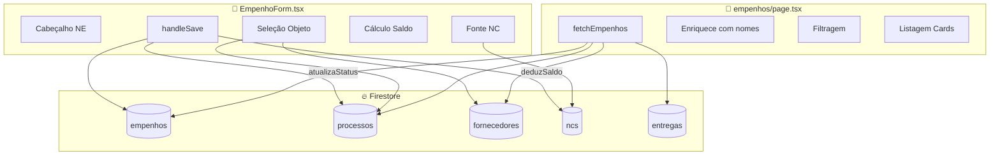

# 09 - EMPENHOS - Análise Detalhada

## 1. Visão Geral

| Atributo | Valor |
|----------|-------|
| **Propósito** | Emitir Notas de Empenho (NE) vinculando NC, Processo e Fornecedor |
| **Responsabilidades** | CRUD de empenhos, dedução de saldo da NC, autopreenchimento de itens |
| **Posição na Arquitetura** | 💰 **FINANCEIRO** - Ponte entre orçamento e execução |

O módulo de Empenhos é o **ponto central de integração** do sistema, conectando:
- **Notas de Crédito** (origem do recurso)
- **Processos** (objeto da compra)
- **Fornecedores** (destinatário do recurso)

---

## 2. Arquivos Analisados

| Arquivo | Caminho | Linhas | Bytes |
|---------|---------|--------|-------|
| **page.tsx** | `src/app/(dashboard)/empenhos/page.tsx` | 337 | 22.035 |
| **EmpenhoForm.tsx** | `src/features/empenhos/components/EmpenhoForm.tsx` | 423 | 21.991 |
| **TOTAL** | - | **760** | **44.026** |

**Complexidade**: 🔴 Alta

---

## 3. Fluxo de Dados



---

## 4. Estrutura de Dados

### Estrutura de um Empenho
```typescript
{
    id: string;
    numero: string;              // "2024NE000123"
    nd: string;                  // "339030"
    tipo: "ORDINARIO" | "GLOBAL" | "ESTIMATIVO";
    dataEmissao: Date;
    id_processo: string;         // FK → processos
    id_fornecedor: string;       // FK → fornecedores
    id_nc: string;               // FK → ncs
    valorEmpenhado: number;
    itens: ItemEmpenho[];
    status: "EMPENHADO" | "CONCLUIDO";
    
    // Campos enriquecidos (join)
    nomeProcesso?: string;
    nomeFornecedor?: string;
    cnpjFornecedor?: string;
    telefoneFornecedor?: string;
    emailFornecedor?: string;
}
```

---

## 5. Funções Principais

### 5.1 `fetchEmpenhos()` - Carregamento com Joins

```typescript
// empenhos/page.tsx:28-66
const fetchEmpenhos = async () => {
    // 1. Buscar Empenhos
    const empenhosRaw = empSnap.docs.map(d => ({ id: d.id, ...d.data() }));
    
    // 2. Buscar auxiliares (processos, fornecedores, entregas)
    // 3. Criar dicionários para busca O(1)
    const procMap: any = {};
    const fornMap: any = {};
    
    // 4. Unir tudo (enriquecer)
    const empenhosCompletos = empenhosRaw.map((e) => ({
        ...e,
        nomeProcesso: procMap[e.id_processo]?.numero || "Desconhecido",
        nomeFornecedor: fornMap[e.id_fornecedor]?.empresa || "Desconhecido",
        cnpjFornecedor: fornMap[e.id_fornecedor]?.cnpj,
        telefoneFornecedor: fornMap[e.id_fornecedor]?.telefone,
        emailFornecedor: fornMap[e.id_fornecedor]?.email
    }));
};
```

---

### 5.2 Autopreenchimento ao Selecionar Fornecedor

```typescript
// EmpenhoForm.tsx:92-138
useEffect(() => {
    if (procId && fornId && !initialData) {
        const fornecedor = listas.fornecedores.find(f => f.id === fornId);
        const vinculo = fornecedor.processosVinculados?.find(v => v.processoId === procId);
        
        if (vinculo && vinculo.itens) {
            // Enriquecer com descrição e quantidade do processo
            const itensDetalhados = vinculo.itens.map((itemVinculo) => {
                const itemOriginal = processo.itens.find(i => i.id === itemVinculo.itemId);
                return {
                    ...itemVinculo,
                    descricao: itemOriginal?.descricao,
                    quantidade: itemOriginal?.quantidade || 1
                };
            });
            
            setItensEmpenho(itensDetalhados);
            
            // Calcula total sugerido
            const totalGanho = itensDetalhados.reduce(...);
            setValor(totalGanho.toString());
        }
    }
}, [procId, fornId, ...]);
```

---

### 5.3 Cálculo de Saldo da NC

```typescript
// EmpenhoForm.tsx:140-154
const selectedNC = listas.ncs.find(n => n.id === ncId);

// Calcular saldo dinamicamente
const empenhosNC = listas.empenhos.filter(e => e.id_nc === selectedNC?.id);
const totalEmpenhado = empenhosNC.reduce((acc, e) => acc + e.valorEmpenhado, 0);
const saldoNCCalculado = selectedNC.valorTotal - totalEmpenhado;

// Se editando, considerar valor anterior
const valorAnterior = initialData ? initialData.valorEmpenhado : 0;
const saldoBase = initialData?.id_nc === ncId ? saldoNCCalculado + valorAnterior : saldoNCCalculado;

const saldoRestante = saldoBase - valorEmpenhoNum;
```

---

### 5.4 `handleSave()` - Salvamento com Automações

```typescript
// EmpenhoForm.tsx:156-219
const handleSave = async (e: React.FormEvent) => {
    // Validações
    if (saldoRestante < 0) {
        if (!confirm("Valor excede saldo. Continuar?")) return;
    }
    
    // Salvar empenho
    if (empenhoId) {
        // EDIÇÃO: Devolver saldo à NC antiga, deduzir da nova
        await updateDoc(ncAntigaRef, { saldoDisponivel: saldoAtual + valorAnterior });
        await updateDoc(ncNovaRef, { saldoDisponivel: saldoRestante });
        await updateDoc(doc(db, "empenhos", empenhoId), data);
    } else {
        // CRIAÇÃO
        await addDoc(collection(db, "empenhos"), data);
        await updateDoc(ncRef, { saldoDisponivel: saldoRestante });
        
        // AUTOMAÇÃO: Atualiza status do processo
        if (procStatus === "AGUARDANDO_EMPENHO" || procStatus === "AGUARDANDO_FORNECEDOR") {
            await updateDoc(procRef, { status: "AGUARDANDO_ENTREGA" });
        }
    }
};
```

---

### 5.5 Filtros Inteligentes

**Processos Filtrados** (linha 221-244):
```typescript
const processosFiltrados = listas.processos.filter((p) => {
    if (showAllProcesses) return true;
    
    // Excluir concluídos/cancelados
    if (p.status === "CONCLUIDO" || p.status === "CANCELADO") return false;
    
    // Verificar se tem fornecedor SEM empenho
    const fornecedoresDoProcesso = listas.fornecedores.filter(f =>
        f.processosVinculados?.some(v => v.processoId === p.id)
    );
    
    const algumFornecedorSemEmpenho = fornecedoresDoProcesso.some(f => {
        const temEmpenho = listas.empenhos.some(emp =>
            emp.id_processo === p.id && emp.id_fornecedor === f.id
        );
        return !temEmpenho;
    });
    
    return algumFornecedorSemEmpenho;
});
```

**NCs Filtradas** (linha 250-265):
- Filtra por ND selecionada
- Exibe apenas NCs com saldo disponível
- Exceção: Se editando, sempre mostra a NC atual

---

## 6. Tipos de Empenho

| Tipo | Descrição |
|------|-----------|
| **Ordinário** | Pagamento único, valor exato |
| **Global** | Pagamento parcelado ao longo do exercício |
| **Estimativo** | Valor estimado (despesas variáveis) |

---

## 7. UI/UX Features

### 7.1 Cards com Detalhes do Fornecedor

```
┌─────────────────────────────────────────────────┐
│ 💳 2024NE000123      [EMPENHADO] [ORDINÁRIO]   │
│ Processo: 2024/001                              │
│ Fornecedor: Empresa XYZ Ltda                    │
│                           Valor: R$ 15.000,00   │
└─────────────────────────────────────────────────┘
         ▼ (expandido)
    ┌─────────────────────────────────────────────┐
    │ CNPJ: 00.000.000/0001-00                    │
    │ Telefone: (11) 99999-9999                   │
    │ Email: contato@empresa.com                  │
    │                                             │
    │ ND: 339030 | Emissão: 15/01/2024            │
    │ Liquidado: R$ 5.000,00                      │
    │                                             │
    │ Itens do Empenho:                           │
    │ ┌─────────────────────────────────────┐     │
    │ │ Material A  | R$ 50 x 100 = R$ 5k  │     │
    │ │ Material B  | R$ 100 x 100 = R$ 10k│     │
    │ └─────────────────────────────────────┘     │
    └─────────────────────────────────────────────┘
```

### 7.2 Exibição de Saldo em Tempo Real

```
┌──────────────────────┬──────────────────────┐
│ Total Empenhado (R$) │  Saldo Restante NC  │
│ R$ 15.000,00 ✏️      │  R$ 35.000,00       │
│ Sugerido com itens   │  Após dedução       │
└──────────────────────┴──────────────────────┘
```

---

## 8. Dependências

### Internas
| Módulo | Uso |
|--------|-----|
| **NCs** | FK `id_nc`, dedução de saldo |
| **Processos** | FK `id_processo`, atualização de status |
| **Fornecedores** | FK `id_fornecedor`, dados de contato |
| **Entregas** | Cálculo de liquidação |

---

## 9. Padrões e Boas Práticas

### ✅ Boas Práticas

| Prática | Descrição |
|---------|-----------|
| **Autopreenchimento** | Itens e valor sugeridos ao selecionar fornecedor |
| **Saldo em tempo real** | Recalcula a cada digitação |
| **Filtros inteligentes** | Mostra apenas processos/NCs elegíveis |
| **Automação de status** | Processo → AGUARDANDO_ENTREGA |
| **Devolução de saldo** | Ao editar, devolve saldo à NC anterior |

### ⚠️ Code Smells

| Problema | Localização | Severidade |
|----------|-------------|------------|
| **Tipagem `any`** | page.tsx:16,17,25 / Form:22,45 | 🟠 Média |
| **Lógica complexa inline** | EmpenhoForm.tsx:92-138 | 🟠 Média |
| **Componente grande** | EmpenhoForm.tsx (423 linhas) | 🟠 Média |
| **5 queries paralelas** | EmpenhoForm.tsx:48-59 | 🟡 Baixa |

### 🔧 Sugestões de Melhoria

#### 1. Extrair hooks customizados
```typescript
// ❌ Atual - useEffect gigante
useEffect(() => {
    // 50+ linhas de lógica
}, [...]);

// ✅ Sugerido
const { itensEmpenho, valorSugerido } = useAutopreenchimento(procId, fornId, listas);
const { saldoRestante, ncsFiltradas } = useSaldoNC(ncId, valor, listas);
```

#### 2. Criar service layer
```typescript
// ❌ Atual - Firestore direto no componente
await updateDoc(ncRef, { saldoDisponivel: saldoRestante });

// ✅ Sugerido
await empenhoService.save(data, { deduzirSaldoNC: true });
```

---

## 10. Testes

| Status | Descrição |
|--------|-----------|
| ❌ **Não há testes** | Módulo crítico sem cobertura |

**Casos de Teste Prioritários**:
| Cenário | Tipo | Prioridade |
|---------|------|------------|
| Autopreenchimento de itens | Integração | 🔴 Alta |
| Cálculo de saldo NC | Unitário | 🔴 Alta |
| Edição com troca de NC | Integração | 🔴 Alta |
| Filtros de processos | Unitário | 🟠 Média |

---

## 📋 Resumo da Análise

| Métrica | Valor |
|---------|-------|
| **Linhas de Código** | 760 |
| **Arquivos** | 2 |
| **FKs (relacionamentos)** | 3 (NC, Processo, Fornecedor) |
| **Automações** | 3 (saldo, status, itens) |
| **Code Smells** | 4 |
| **Nível de Maturidade** | 🟡 Médio |

### Veredicto Final

O módulo é **funcional e sofisticado**, sendo o mais complexo do sistema:
- ✅ Autopreenchimento inteligente
- ✅ Controle de saldo em tempo real
- ✅ Automação de status do processo

Melhorias prioritárias:
1. Extrair lógica para hooks/services
2. Tipagem forte para evitar `any`
3. Adicionar testes (módulo crítico!)

---

## 🔜 Próximo Módulo

**Módulo 9: Entregas** (`entregas/page.tsx` + `EntregaForm.tsx`)

Aguardo seu **"OK"** para prosseguir.
