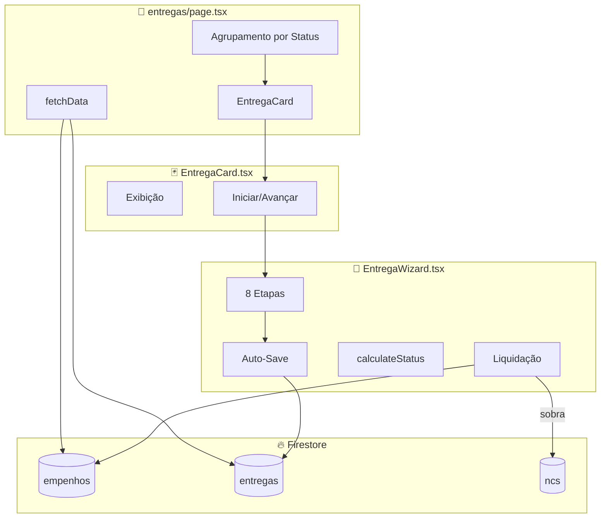
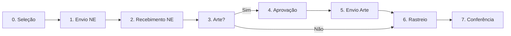

# 10 - ENTREGAS - Análise Detalhada

## 1. Visão Geral

| Atributo | Valor |
|----------|-------|
| **Propósito** | Gerenciar ciclo de vida de entregas: empenho → liquidação |
| **Responsabilidades** | Wizard de etapas, status dinâmico, controle de arte, rastreio, liquidação |
| **Posição na Arquitetura** | 📦 **OPERACIONAL** - Execução física dos empenhos |

O módulo de Entregas é o **mais complexo do sistema em termos de UX**, implementando um wizard de 8 etapas com auto-save e animações.

---

## 2. Arquivos Analisados

| Arquivo | Caminho | Linhas | Bytes |
|---------|---------|--------|-------|
| **page.tsx** | `src/app/(dashboard)/entregas/page.tsx` | 262 | 13.055 |
| **EntregaCard.tsx** | `src/features/entregas/components/EntregaCard.tsx` | 113 | 5.995 |
| **EntregaWizard.tsx** | `src/features/entregas/components/EntregaWizard.tsx` | 703 | 38.568 |
| **TOTAL** | - | **1.078** | **57.618** |

**Complexidade**: 🔴 Alta

---

## 3. Fluxo de Dados



---

## 4. Workflow de 8 Etapas



| Etapa | Status Firestore | Descrição |
|-------|------------------|-----------|
| 0 | - | Seleção de quantidades (Global/Estimativo) |
| 1 | AGUARDANDO_ENVIO_EMPENHO | Empenho enviado ao fornecedor |
| 2 | AGUARDANDO_RECEBIMENTO_EMPENHO | Confirmar recebimento |
| 3 | AGUARDANDO_DEFINICAO_ARTE | Precisa de arte? |
| 4 | AGUARDANDO_APROVACAO_ARTE | Arte em aprovação |
| 5 | AGUARDANDO_ENVIO_ARTE | Enviar arte ao fornecedor |
| 6 | EM_PRODUCAO / ENVIADO | Rastreio e prazo |
| 7 | LIQUIDADO | Conferência final |

---

## 5. Funções Principais

### 5.1 `calculateStatus()` - Determinação de Status

```typescript
// EntregaWizard.tsx:111-121
const calculateStatus = (values: any) => {
    if (values.conferido) return 'LIQUIDADO';
    if (values.codigoRastreio || values.semRastreio) return 'ENVIADO';
    if (values.arteEnviada) return 'EM_PRODUCAO';
    if (values.arteAprovada) return 'AGUARDANDO_ENVIO_ARTE';
    if (values.reqArte === true) return 'AGUARDANDO_APROVACAO_ARTE';
    if (values.reqArte === false) return 'EM_PRODUCAO';
    if (values.recebidoEmpenho) return 'AGUARDANDO_DEFINICAO_ARTE';
    if (values.enviadoEmpenho) return 'AGUARDANDO_RECEBIMENTO_EMPENHO';
    return 'AGUARDANDO_ENVIO_EMPENHO';
};
```

---

### 5.2 `autoSave()` - Salvamento Automático

```typescript
// EntregaWizard.tsx:123-176
const autoSave = async (overrideValues?: any) => {
    const currentValues = {
        selectedItems, enviadoEmpenho, recebidoEmpenho,
        reqArte, arteAprovada, arteEnviada,
        codigoRastreio, semRastreio, prazo, conferido,
        ...overrideValues
    };
    
    const status = calculateStatus(currentValues);
    
    const entregaData = {
        id_empenho, empenhoNumero, fornecedorNome, tipo,
        itens: currentValues.selectedItems,
        status,
        etapas: { ...currentValues },
        rastreio, semRastreio, prazo,
        dataAtualizacao: new Date()
    };
    
    if (activeId) {
        await updateDoc(doc(db, "entregas", activeId), entregaData);
    } else {
        const docRef = await addDoc(collection(db, "entregas"), {...});
        setActiveId(docRef.id);
    }
};
```

**Gatilhos de Auto-Save**:
- Mudança em checkbox (imediato)
- Digitação em input (debounce 1000ms)

---

### 5.3 `handleFinish()` - Liquidação

```typescript
// EntregaWizard.tsx:216-277
const handleFinish = async () => {
    // 1. Calcular total liquidado
    const totalLiquidado = selectedItems.reduce((acc, item) => {
        return acc + (item.quantidadeSolicitada * item.valorGanho);
    }, 0);
    
    // 2. Calcular sobra (Estimativo)
    let sobra = 0;
    if (data.tipo === 'ESTIMATIVO') {
        sobra = valorOriginal - totalLiquidado;
    }
    
    // 3. Atualizar entrega → LIQUIDADO
    await updateDoc(doc(db, "entregas", activeId), { 
        status: 'LIQUIDADO',
        valores: { liquidado: totalLiquidado, sobra }
    });
    
    // 4. Atualizar empenho → LIQUIDADO
    if (data.tipo !== 'GLOBAL') {
        await updateDoc(doc(db, "empenhos", empenhoId), { status: 'LIQUIDADO' });
    }
    
    // 5. Devolver sobra à NC
    if (sobra > 0) {
        await updateDoc(ncRef, { 
            saldoDisponivel: currentSaldo + sobra 
        });
    }
};
```

---

### 5.4 Agrupamento por Status na Listagem

```typescript
// entregas/page.tsx:113-123
const groupedEntregas = {
    'AGUARDANDO_ENVIO_EMPENHO': filteredEntregas.filter(e => e.status === 'AGUARDANDO_ENVIO_EMPENHO'),
    'AGUARDANDO_RECEBIMENTO_EMPENHO': filteredEntregas.filter(...),
    'AGUARDANDO_DEFINICAO_ARTE': filteredEntregas.filter(...),
    'AGUARDANDO_APROVACAO_ARTE': filteredEntregas.filter(...),
    'AGUARDANDO_ENVIO_ARTE': filteredEntregas.filter(...),
    'EM_PRODUCAO': filteredEntregas.filter(...),
    'ENVIADO': filteredEntregas.filter(...),
    'ENTREGUE': filteredEntregas.filter(...),
    'LIQUIDADO': filteredEntregas.filter(...)
};
```

---

## 6. UI/UX Features

### 6.1 Cards Compactos com Status Visual

```
┌──────────────────────────────────┐
│ 📦 2024NE000123          [🟢]   │
│ Empresa XYZ                      │
│ Valor: R$ 15.000 | Prazo: 30/03  │
│ [👁️ Itens]         [▶ Iniciar]  │
└──────────────────────────────────┘
```

### 6.2 Wizard com Animações

```typescript
// EntregaWizard.tsx:674-685
<AnimatePresence mode="wait">
    <motion.div
        key={currentStep}
        initial={{ opacity: 0, x: 20 }}
        animate={{ opacity: 1, x: 0 }}
        exit={{ opacity: 0, x: -20 }}
        transition={{ duration: 0.2 }}
    >
        {renderStepContent()}
    </motion.div>
</AnimatePresence>
```

### 6.3 Cálculo Automático de Prazo

```typescript
// Ao confirmar recebimento do empenho + 30 dias
if (reqArte === false && dataRecebimentoEmpenho) {
    const d = new Date(dataRecebimentoEmpenho);
    d.setDate(d.getDate() + 30);
    setPrazo(d.toISOString().split('T')[0]);
}
```

---

## 7. Dependências

### Externas
| Biblioteca | Uso |
|------------|-----|
| `framer-motion` | Animações do wizard |
| `firebase/firestore` | CRUD de entregas |

### Internas
| Módulo | Uso |
|--------|-----|
| Empenhos | FK `id_empenho` |
| NCs | Devolução de sobra |

---

## 8. Padrões e Boas Práticas

### ✅ Boas Práticas

| Prática | Descrição |
|---------|-----------|
| **Auto-Save** | Salva a cada interação, sem botão "Salvar" |
| **Debounce** | 1000ms para inputs de texto |
| **Skip Logic** | Pula etapas de arte se não necessário |
| **Cálculo de Prazo** | Automático (recebimento + 30 dias) |
| **Devolução de Sobra** | Atualiza saldo da NC |
| **Agrupamento Visual** | Entregas por status |

### ⚠️ Code Smells

| Problema | Localização | Severidade |
|----------|-------------|------------|
| **Tipagem `any`** | page.tsx:16,17,21,26 | 🟠 Média |
| **Componente enorme** | EntregaWizard.tsx (703 linhas) | 🔴 Alta |
| **Switch gigante** | EntregaWizard.tsx:280-651 | 🟠 Média |
| **Lógica duplicada** | Cálculo de prazo em vários lugares | 🟡 Baixa |

### 🔧 Sugestões de Melhoria

#### 1. Extrair componentes para cada etapa
```typescript
// ❌ Atual - switch gigante
const renderStepContent = () => {
    switch (currentStep) {
        case 0: return <div>...</div>; // 50+ linhas
        case 1: return <div>...</div>; // 50+ linhas
        // ...
    }
}

// ✅ Sugerido
<StepSelecao />
<StepEnvioEmpenho />
<StepRecebimentoEmpenho />
// etc.
```

#### 2. Criar hook para auto-save
```typescript
// ❌ Atual - autoSave inline
const autoSave = async (overrideValues?: any) => {...}

// ✅ Sugerido
const { save, isSaving } = useAutoSave('entregas', activeId);
```

---

## 9. Testes

| Status | Descrição |
|--------|-----------|
| ❌ **Não há testes** | Módulo crítico sem cobertura |

**Casos de Teste Prioritários**:
| Cenário | Tipo | Prioridade |
|---------|------|------------|
| Fluxo completo sem arte | E2E | 🔴 Alta |
| Fluxo completo com arte | E2E | 🔴 Alta |
| Cálculo de sobra | Unitário | 🟠 Média |
| Skip logic | Unitário | 🟠 Média |
| Auto-save debounce | Unitário | 🟡 Baixa |

---

## 10. Segurança

| Aspecto | Status |
|---------|--------|
| **Deleção de entrega** | ⚠️ Sem confirmação robusta |
| **Validação de quantidades** | ⚠️ Apenas client-side |

---

## 📋 Resumo da Análise

| Métrica | Valor |
|---------|-------|
| **Linhas de Código** | 1.078 |
| **Arquivos** | 3 |
| **Etapas do Wizard** | 8 |
| **Status Possíveis** | 9 |
| **Code Smells** | 4 |
| **Nível de Maturidade** | 🟢 Alto (UX) / 🟡 Médio (código) |

### Veredicto Final

O módulo é **o mais sofisticado em termos de UX**, com destaque para:
- ✅ Wizard multi-etapas com animações
- ✅ Auto-save transparente
- ✅ Cálculo automático de prazos
- ✅ Devolução de sobra à NC

Melhorias prioritárias:
1. **Quebrar EntregaWizard.tsx** em componentes menores
2. Extrair lógica de cálculo para funções puras
3. Adicionar testes E2E para fluxos críticos

---

## 🔜 Próximo Módulo

**Módulo 10: Dashboard** (Visão consolidada e KPIs)

Aguardo seu **"OK"** para prosseguir.
