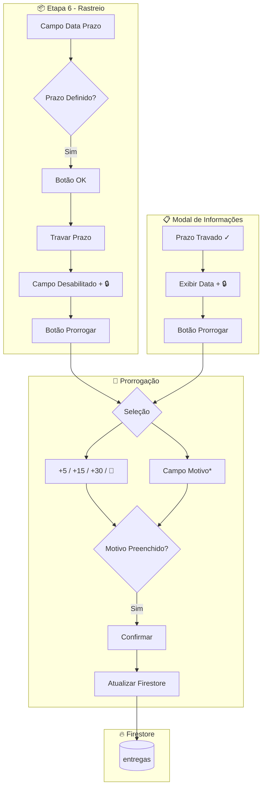

# 13 - PRORROGAÇÕES - Análise Detalhada

## 1. Visão Geral

| Atributo | Valor |
|----------|-------|
| **Propósito** | Gerenciar prazos de entrega com travamento e prorrogações controladas |
| **Responsabilidades** | Travar prazo, registrar prorrogações com motivo, histórico de auditoria |
| **Posição na Arquitetura** | 📊 **CONTROLE** - Extensão do módulo de Entregas |

A funcionalidade de prorrogações permite controlar alterações no prazo de entrega com rastreabilidade completa.

---

## 2. Arquivos Modificados

| Arquivo | Caminho | Modificações |
|---------|---------|--------------|
| **EntregaWizard.tsx** | `src/features/entregas/components/EntregaWizard.tsx` | Botão OK, seção prorrogação |
| **page.tsx** | `src/app/(dashboard)/entregas/page.tsx` | Modal com prorrogação |

---

## 3. Fluxo de Dados



---

## 4. Estrutura de Dados

### Campos na Coleção `entregas`:

```typescript
interface Entrega {
    // ... campos existentes ...
    
    // Prazo de Entrega
    prazo: string;               // Data limite ISO - já existia
    prazoTravado: boolean;       // NOVO: se o prazo está confirmado
    dataPrazoTravado: string;    // NOVO: quando foi travado (ISO)
    
    // Histórico de Prorrogações
    historicoProrrogacoes: [{    // NOVO: array de prorrogações
        dataProrrogacao: string; // Timestamp ISO da prorrogação
        prazoAnterior: string;   // Data limite anterior
        prazoNovo: string;       // Nova data limite
        diasAdicionados: number; // +5, +15, +30 ou custom
        motivo: string;          // Motivo obrigatório
    }];
}
```

### Exemplo de Documento:

```json
{
    "id": "abc123",
    "prazo": "2026-03-15T00:00:00.000Z",
    "prazoTravado": true,
    "dataPrazoTravado": "2026-01-30T15:30:00.000Z",
    "historicoProrrogacoes": [
        {
            "dataProrrogacao": "2026-02-10T10:00:00.000Z",
            "prazoAnterior": "2026-02-28",
            "prazoNovo": "2026-03-15",
            "diasAdicionados": 15,
            "motivo": "Atraso na produção do fornecedor"
        }
    ]
}
```

---

## 5. Regras de Negócio

| Regra | Descrição |
|-------|-----------|
| **Travamento obrigatório** | Só é possível prorrogar após travar o prazo |
| **Motivo obrigatório** | Toda prorrogação requer justificativa textual |
| **Opções rápidas** | +5, +15 ou +30 dias a partir do prazo atual |
| **Data customizada** | Calendário para escolher data específica |
| **Sem limite de prorrogações** | Histórico ilimitado |
| **Auditoria completa** | Cada prorrogação registra prazo anterior, novo, dias e motivo |

---

## 6. Interface do Usuário

### 6.1 Etapa de Rastreio (Wizard)

```
┌──────────────────────────────────────────────────────────┐
│ Prazo de Entrega                            ✓ Confirmado │
│ ┌────────────────────────────────┐ ┌─────────┐ ┌───┐    │
│ │ 📅 2026-02-28                  │ │ ✓ OK    │ │🔒 │    │
│ └────────────────────────────────┘ └─────────┘ └───┘    │
│                                                          │
│ ┌────────────────────────────────────────────────────┐  │
│ │ 📅 Prorrogar Prazo                                 │  │
│ └────────────────────────────────────────────────────┘  │
└──────────────────────────────────────────────────────────┘
```

### 6.2 Seção de Prorrogação Expandida

```
┌──────────────────────────────────────────────────────────┐
│ Prorrogar Prazo                                      ✕   │
├──────────────────────────────────────────────────────────┤
│ ┌───────┐ ┌───────┐ ┌───────┐ ┌─────────────────────┐   │
│ │  +5   │ │  +15  │ │  +30  │ │ 📅 Data específica  │   │
│ └───────┘ └───────┘ └───────┘ └─────────────────────┘   │
│                                                          │
│ Motivo *                                                 │
│ ┌────────────────────────────────────────────────────┐  │
│ │ Descreva o motivo da prorrogação...                │  │
│ └────────────────────────────────────────────────────┘  │
│                                                          │
│ ┌────────────────────────────────────────────────────┐  │
│ │              Confirmar Prorrogação                 │  │
│ └────────────────────────────────────────────────────┘  │
│                                                          │
│ Histórico (2)                                            │
│   +15 dias    Atraso na produção                        │
│   +5 dias     Ajuste de cronograma                      │
└──────────────────────────────────────────────────────────┘
```

---

## 7. Locais de Acesso

| Local | Como Acessar |
|-------|--------------|
| **Wizard de Entrega** | Entregas → Gerenciar → Etapa 6 (Rastreio) |
| **Modal de Informações** | Entregas → Ícone de olho no card → Botão "Prorrogar" |

---

## 8. Compatibilidade

| Aspecto | Status |
|---------|--------|
| **Entregas existentes** | ✅ Compatível - `prazoTravado: undefined` tratado como `false` |
| **Migração** | ❌ Não necessária |
| **Back-end** | ✅ Firestore atualizado automaticamente |

---

## 📋 Resumo

| Métrica | Valor |
|---------|-------|
| **Campos novos** | 3 (prazoTravado, dataPrazoTravado, historicoProrrogacoes) |
| **Arquivos modificados** | 2 |
| **Opções de prorrogação** | 4 (+5, +15, +30, calendário) |
| **Locais de acesso** | 2 (Wizard, Modal) |
