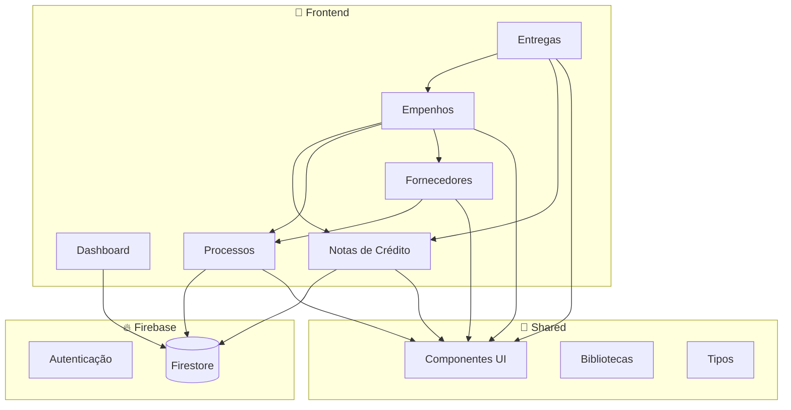
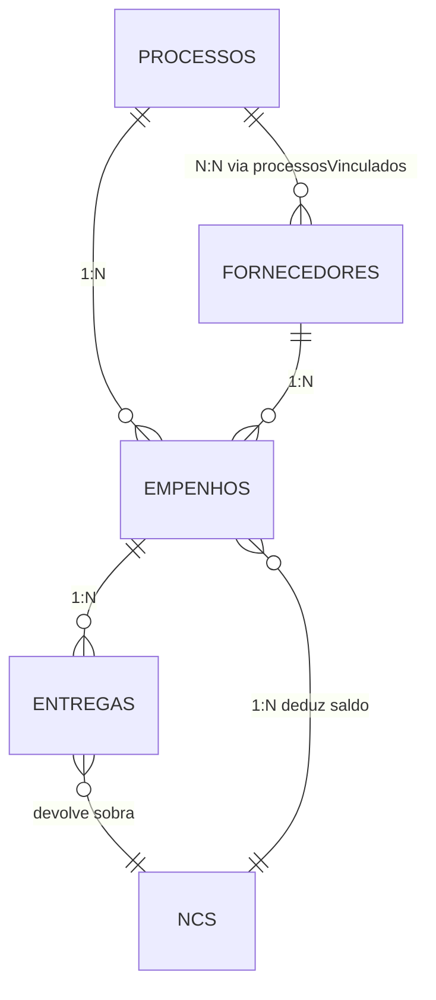

# 99 - RELATÓRIO FINAL DE ANÁLISE

## 📋 Sumário Executivo

| Atributo | Valor |
|----------|-------|
| **Projeto** | SGC Gestão - Sistema de Gestão de Compras |
| **Framework** | Next.js 14 + TypeScript + Firebase |
| **Data da Análise** | Janeiro 2026 |
| **Linhas Analisadas** | ~6.500 |
| **Documentos Gerados** | 12 |

---

## 📊 Métricas Consolidadas

### Linhas de Código por Módulo

| Módulo | Arquivos | Linhas | Bytes |
|--------|----------|--------|-------|
| **Tipos e Domínio** | 1 | 106 | 3.207 |
| **Autenticação** | 3 | 337 | 14.247 |
| **Bibliotecas** | 3 | 198 | 5.817 |
| **Componentes UI** | 12 | 866 | 24.802 |
| **Processos** | 2 | 737 | 38.424 |
| **Fornecedores** | 3 | 930 | 53.598 |
| **Notas de Crédito** | 2 | 659 | 33.849 |
| **Empenhos** | 2 | 760 | 44.026 |
| **Entregas** | 3 | 1.078 | 57.618 |
| **Dashboard** | 1 | 401 | 20.615 |
| **TOTAL** | **32** | **~6.072** | **~296 KB** |

---

## 🏗️ Arquitetura Identificada



---

## 🔗 Relacionamentos Entre Entidades



---

## ✅ Pontos Fortes

| Área | Destaque |
|------|----------|
| **UX** | Wizard de entregas com 8 etapas e auto-save |
| **Performance** | Promise.all para carregamento paralelo |
| **Automações** | Status de processo → AGUARDANDO_ENTREGA ao empenhar |
| **Visualização** | Dashboard com gráficos animados (framer-motion) |
| **Filtros** | Filtro dinâmico por ND em todo o orçamento |
| **Busca Inteligente** | CNPJ/Nome em fornecedores com debounce |
| **Controle de Saldo** | Dedução/devolução automática de saldo NC |

---

## ⚠️ Padrões de Code Smells Identificados

### Tipagem `any`

| Módulo | Ocorrências | Severidade |
|--------|-------------|------------|
| Processos | 15+ | 🟠 |
| Fornecedores | 10+ | 🟠 |
| Empenhos | 8+ | 🟠 |
| Entregas | 12+ | 🟠 |
| Dashboard | 5+ | 🟡 |

**Recomendação**: Criar interfaces tipadas para todas as entidades em `types/index.ts`.

### Componentes Grandes

| Arquivo | Linhas | Recomendação |
|---------|--------|--------------|
| `EntregaWizard.tsx` | 703 | Extrair etapas em componentes |
| `ProcessoForm.tsx` | 452 | Extrair seções |
| `page.tsx` (processos) | 285 | Extrair cards |

### Alert Nativo

| Módulo | Uso |
|--------|-----|
| Processos | `alert("Processocriado!")` |
| Fornecedores | `alert("...")` |
| Empenhos | `alert("...")` |
| NCs | `alert("...")` |

**Recomendação**: Usar toast/snackbar do Radix UI.

---

## 🧪 Cobertura de Testes

| Status | Descrição |
|--------|-----------|
| ❌ **0%** | Nenhum teste automatizado encontrado |

### Prioridade de Testes

| Prioridade | Módulo | Cenário |
|------------|--------|---------|
| 🔴 Alta | Empenhos | Dedução de saldo NC |
| 🔴 Alta | Entregas | Fluxo completo wizard |
| 🔴 Alta | Entregas | Devolução de sobra |
| 🟠 Média | Processos | CRUD completo |
| 🟠 Média | Fornecedores | Busca inteligente |

---

## 🔒 Segurança

| Aspecto | Status | Observação |
|---------|--------|------------|
| Autenticação | ✅ | Firebase Auth + Google Provider |
| Autorização | ⚠️ | Sem controle de roles/permissões |
| Validação | ⚠️ | Apenas client-side |
| Soft-Delete | ❌ | Deleções são permanentes |
| Auditoria | ❌ | Sem log de alterações |

---

## 📈 Sugestões de Melhoria

### Curto Prazo (Quick Wins)

1. **Substituir `alert()` por Toast** - 2h
2. **Tipar entidades principais** - 4h
3. **Adicionar `createdAt/updatedAt`** - 2h

### Médio Prazo

1. **Extrair hooks customizados** - 8h
   - `useAutoSave()`
   - `useSaldoNC()`
   - `useAutopreenchimento()`

2. **Componentizar wizards** - 8h
   - Cada etapa = 1 componente

3. **Adicionar testes E2E** - 16h
   - Playwright para fluxos críticos

### Longo Prazo

1. **Sistema de permissões** - 24h
2. **Auditoria de alterações** - 16h
3. **Relatórios PDF** - 16h

---

## 📁 Estrutura de Documentação Gerada

```
docs/
├── 00-VISAO-GERAL.md           ← Visão macro do sistema
├── 01-PLANO-DE-ANALISE.md      ← Metodologia (obsoleto, remover)
├── 02-TIPOS-E-DOMINIO.md       ← Entidades e enums
├── 03-AUTENTICACAO.md          ← Login, middleware, layout
├── 04-BIBLIOTECAS-UTILITARIAS.md ← Firebase, formatters, excel
├── 05-COMPONENTES-UI.md        ← Button, Input, Dialog, etc.
├── 06-PROCESSOS.md             ← CRUD de licitações
├── 07-FORNECEDORES.md          ← Vencedores das licitações
├── 08-NOTAS-DE-CREDITO.md      ← Origem dos recursos
├── 09-EMPENHOS.md              ← Vinculação NC↔Processo↔Forn
├── 10-ENTREGAS.md              ← Wizard de 8 etapas
├── 11-DASHBOARD.md             ← KPIs e gráficos
└── 99-RELATORIO-FINAL.md       ← Este documento
```

---

## 🎯 Conclusão

O **SGC Gestão** é um sistema **funcional e bem estruturado** para gestão de compras públicas, com:

| Aspecto | Avaliação |
|---------|-----------|
| **Funcionalidade** | 🟢 Completo |
| **UX/UI** | 🟢 Excelente |
| **Código** | 🟡 Bom, mas com dívida técnica |
| **Testes** | 🔴 Inexistente |
| **Segurança** | 🟡 Básica |
| **Documentação** | 🟢 Agora completa! |

### Nível de Maturidade Geral: **🟡 Médio-Alto**

O sistema está pronto para uso, mas precisa de:
1. Tipagem forte
2. Testes automatizados
3. Sistema de permissões

---

## 📞 Próximos Passos Sugeridos

1. [ ] Criar interfaces TypeScript para todas as entidades
2. [ ] Adicionar testes E2E para fluxos críticos
3. [ ] Implementar sistema de notificações (Toast)
4. [ ] Adicionar soft-delete em todas as coleções
5. [ ] Criar sistema de permissões por usuário
